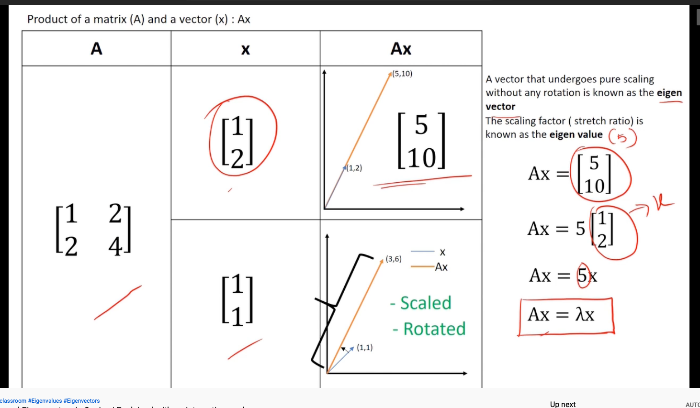

## Goals
- Dimension reduction technique 
- Trying to narrow our dataset to fewer variables

## Eigenvalues and Eigenvectors
These are used to describe the shape of multivariate data. Formal definition:
- If A is an n*n matrix, the eigenvalue of A is the scalar (λ) provided there is a nonzero vector $\bar{x}$ that allows the following to be true:
  - $A\bar{x} = λ\bar{x}$
  - λ is the Eigenvalue
    - A scalar that gives us the magnitude of the Eigenvector
  - $\bar{x}$ is the Eigenvector of A corresponding to λ
    - Any nonzero multiple of this matrix is also an Eigenvector of A

[Eigenvalues and Eigenvectors demonstration](https://www.youtube.com/watch?v=5UjQVJu89_Q&feature=emb_title) from Solid Mechanics Classroom:

```{r}

```
### Eigenvalues
- For an n x n matrix A, there are n eigenvalues $λ_1, λ_2...,λ_ν$ 
#### Eigenvalue Math
$|A - λ_iI = 0$
- i is 1...n
- A: Determinant of Matrix A
- I = identity matrix
- Solving gives us eigenvalue $λ_ι$ for i = 1...n
#### Eigenvalues in R
- Use the `eigen(A)` function
  - Pass in the matrix, in this case 'A'
  - Returns the values and vectors as a list, respectively
  - We can pull the value directly from that list with `eigen(A)$value`
- In this example we store the eigenvalues in 'lambda' 

```{r}
A <- matrix (c(2, -3, -3, 1), nrow = 2)
lambda <- eigen(A)$value

# For 2 x 2 matrix, we have 2 eigenvalues:
lambda
```

#### Math and R
- Remember our equation:

  $|A - λ_iI = 0$
- If we plug in our eigenvalue and identity matrix, we should get zero
- Use `diag()` to find the identity matrix  

```{r}
# identity matrix
I <- diag(2)
```

```{r}
# first eigenvalue
i=1

# Eigenequation, using eigenvalues (lambda) and identity matrix (I)
round(det(A-lambda[i]*I), 10) # round to 10 decimal places
```

```{r}
# The second eigenvalue
 i=2
round(det(A-lambda[i]*I), 10) # round to 10 decimal places
```

### Eigenvector
#### Math
- If we know scalar λ is an eigenvalue of A, then there is a nonzero vector x with this relationship:
$Ax_i = λ_ix_i$ or $Ax = λx$
- Fancy algebra gives us:
$(A - λ_iI)x_i = 0$

#### Eigenvector in R
- Similar to before, we can use the `eigen()` function
  - This time we pull `eigen()$vector` out and store it in x 
  
```{r}
A <- matrix (c(3, 1, 0, 2), nrow = 2)
lambda <- eigen(A)$value
  x <- eigen(A)$vector
# for 2 x 2 matrix, we have 2 eigenvectors
x
```
Check the first eigenvalue and vector
```{r}
I <- diag(2)

# first eigenvalue
i = 1

# solve and round to 10 decimal places
round((A-lambda[i]*I) %*% x[,i], 10)
```

### Eigenvector/value of a Covariance Matrix
- The eigenvector of a covariance matrix shows the directions where the data varies the most 
  - The first eigenvector is the overall most
  - The second eigenvector is the direction of greatest variance orthogonal (perpendicular) to the first vector 
  - Third...and so on
- The eigenvalue is the magnitude of that variability
#### Find in R
The sum of the diagonals of the covariance matrix is the total variance of the data, which is equal to the sum of eigenvalues 
1. Define a covariance matrix S
2. Compare sum of the diagonals of S with the sum of the eigenvalues

```{r}
S <- matrix(c(9, -2, -2, 1), nrow = 2, byrow=TRUE) 
S
```

```{r}
lambda <- eigen(S)$value

# sum the diagonals
trace = sum(diag(S))
trace

# sum the eigenvalues 
sum(lambda)
```

### Confidence Ellipse
- `ellipse()` from the ellipse package returns the outline of a confidence region for bivariate data 
- Ellipse axes: eigenvector
- Ellipse lengths: eigenvalues

```{r}
install.packages("ellipse")
```
Load libraries:
```{r}
library(ellipse)
library(MVA)
```

Sample data of soft drink ratings by students
- Save the column means and covariance for plotting
```{r}
coke<-c(6,9, 8, 8, 6,7,5,0,0,5,8,10,3,9,5,0,6,8,9,10,8, 8, 5, 8)
pepsi<-c(10,5, 9,10,10,0,0,0,0,5,7,6,2,6,2,0,2,3,8, 8,7 , 9, 5, 10)
drpepper<-c(8,6,10,0,7,0,5,0,1,10,3, 6,5,8,7,0,8,6,7,0, 6, 2, 6, 7)
cokpep <- cbind(coke,pepsi)
mean.c <- colMeans(cokpep)
Cov <- cov(cokpep)
```

Plot with jitters to vary the data slightly
```{r}
plot(jitter(coke), jitter(pepsi), ylim =c(-5,15), xlim=c(-5,15))
points(ellipse(Cov, centre = mean.c), type="l")
points(ellipse(Cov, centre = mean.c, level=.50), type="l")
```

#### Confidence Interval Axes
1. Define critical values for axes, create the plot as before
2. Define the axes using the first 2 eigenvectors
```{r}
# define critical values
crit.95 = sqrt(qchisq(.95, 2))
crit.50 = sqrt(qchisq(.5, 2))

# define eigenvector/value
lambda = eigen(Cov)$values
eigvec = eigen(Cov)$vectors

# create plot
plot(jitter(coke), jitter(pepsi), ylim =c(-5,15), xlim=c(-5,15))
points(ellipse(Cov, centre = mean.c), type="l")
points(ellipse(Cov, centre = mean.c, level=.50), type="l")

# define axes
axis1.end = mean.c + sqrt(lambda[1])*crit.95*eigvec[,1]
points(rbind(mean.c, axis1.end), type="l")
points(rbind(mean.c, axis1.end), pch = "x")

axis2.end = mean.c + sqrt(lambda[2])*crit.95*eigvec[,2]
points(rbind(mean.c, axis2.end), type="l")
points(rbind(mean.c, axis2.end), pch = "x")
```

## Principal Component Analysis
- PCA is a multivariate technique with the aim of reducing the number of dimensions in a multivariate data set while capture as much of the original variation as possible 
### Principal Components
- The original variables are transformed to *principal components* which are linear combinations of the original variables
- PCs are uncorrelated and ordered, with the first few accounting for most of the variation in the original variables
  - Trying to describe variation of correlated variables with a new set of uncorrelated variables
- First principal component
  - The linear combination of original variables with the greatest sample variance among all the possible linear combinations
  - The second principal component is the max of remaining variance being uncorrelated with the first PC, subsequent PCs are defined similarly
    - They are uncorrelated by being orthogonal to the previous PCs
### PCA in R
- Sample data of exam scores in different subjects
  - sshist = social science and history
  - Rest are self explanatory
- Link is broken :( leaving code for reference
```{r}
test <- read.csv("http://tiny.cc/isqs6350_test", header = T)
head(test)
cov(test)
```
- Use `princomp()`
  - We pass in cor = T to find the PC of standardized data
- Print the results with `summary()` with loading = T
```{r}
test.pca <- princomp(test, cor = T)
summary(test.pca, loading = T)
```

### Principal Component Scores
- The PC scores are new variables that are linear combinations of the originals based on the eigenvector coefficients
- Eigenvectors are multiplied by scaled variables
- `test.pca$score`

Look at the first six students only:
```{r}
head(pc1 <- test.pca$score[,1])
```

### Principal Component Analysis of Olympic Heptathlon
Analysis of the 1988 Women's Heptathlon Olympics

1. Load the data:
```{r}
data("heptathlon",package="HSAUR2")
head(heptathlon)
```
2. Clean the data
- We're going to reverse the values of the hurdles, run200m, and run800m
  - In these events, the winner should have lower values so we're reversing the direction
```{r}
heptathlon$hurdles <- max(heptathlon$hurdles)-heptathlon$hurdles
heptathlon$run200m <- max(heptathlon$run200m)-heptathlon$run200m
heptathlon$run800m <- max(heptathlon$run800m)-heptathlon$run800m
```

3. Make a scatterplot matrix to see potential outliers
- Exclude the score variable
```{r}
mydata <- heptathlon
mydata$score <- NULL
plot(mydata)
```

4. We notice an outlier, so let's plot the names to find it
```{r}
plot(hurdles ~ highjump, data = mydata,
     cex.lab = 0.7,
     xlab = "Highjump",
     ylab = "Hardles")

# adds text to plot
text(hurdles ~ highjump, data = mydata, labels=(row.names(mydata)))
x <- mydata[, c("highjump", "hurdles")]
library(MVA)
bvbox(x, add = T)
```

5. Remove the outlier (PNG)
```{r}
outlier <- match(lab <- c("Launa (PNG)"), rownames(mydata))
mydata.cln <- mydata [-outlier, ]
```

#### Olympics Principal Component Analysis
- This is a good candidate for PCA since variables are not consistent 
  - E.g. we have time and distance
- Summary of data
  - Looking at Cumulative Proportion, we see the first two components account for 75% of variance
```{r}
heptathlon_pca <- princomp(mydata.cln, cor = T)
summary(heptathlon_pca, loading = T)
```
Find the linear combination coefficients (also called: loadings, eigenvectors)
- Positive and negative signs are based on arbitrary signs of coefficients 
  - Only the magnitude is important
```{r}
heptathlon_pca$loadings[,1]
```
Finally, we can compare the first principal component to the actual scores (minus the outlier) and see that we have a tight correlation:
```{r}
cor(heptathlon$score[-outlier], heptathlon_pca$scores[,1])
```

## Biplots
- These are scatterplots showing both the observations and variables of the of an MVA matrix on the same plot
  - Helps to visually interpret the PC axes
- The distance between the observation points reflects the Mahalanobis distance between the units
- The length of the vectors from the origin to a variable coordinate is the variance of that variable
  - The correlation of two variables is represented by the angle between those corresponding vectors for the two variables
    - Smaller angle = greater correlation
- Reading the biplot
  - Points = observations
  - Arrows = variables
  - Only uses the first 2 PCs
  - The angle between arrows is the correlation
    - Smaller angle = similar directions = more correlation
  - Project a data point onto the direction of an arrow gives the measurement of the variable for that data value
  - Short arrows = those variables are not well represented in the first two PCs

We will use the same Heptathlon PCA from above, excluding the outlier:
```{r}
biplot(heptathlon_pca, col=c("black", "red"), cex = 0.6)
```
Check our interpretation by looking at the z-scores, which represent scaled data
- For example, we see that Joyner-Kersee scores high in all categories
```{r}
options(digits = 2)
scale(mydata.cln)
```
### Angle between Arrows
- To better intuit we can look at the correlation between the PC2 score and the original variables 
  - Notice the positive sign variables also have positive angles to the horizontal line in the middle
```{r}
cor(heptathlon_pca$scores[,2], mydata.cln)
```

## Canonical Correlation Analysis (CCA)
- Used for assessing relationships between two sets of variables rather than within a set of variables
  - Allows us to see what may be common among two sets of data
- The goal is finding linear functions of variables in one set that maximally correlate with linear functions in the other
- A generalization of multiple regression where several variables Y are simultaneously related to multiple variables X 
### CCA Math
- More than one pair of canonical variables can be calculated
- For q variables $X_1, X_2...,X_q$ and p variables $Y_1, Y_2...,Y_p$ CCA finds up to the minimum of q and p variables
 - $min(q,p)$
 
Given data sets:
  $U_1 = a_{11}X_1+a_{12}X_2+...+a_{1q}X_q$
  $U_2 = a_{21}X_2+a_{22}X_2+...+a_{2q}X_q$
  ...
  $U_3 = a_{q1}X_1+a_{q2}X_2+...+a_{qq}X_q$
  and
  $V_1 = b_{11}Y_1+b_{12}Y_2+...+b_{1p}Y_p$
  $V_2 = b_{21}Y_1+b_{22}Y_2+...+b_{2p}Y_p$
  ...
  $V_p = b_{p1}Y_1 + b_{p2}Y_2 +...+b_{pp}Y_p$
  
Choose the pairs of canonical variables:
  $(U_1,V_1),(U_2, V_2),...,(U_{min(p,q)},V_{min(p,q)})$
  - The correlation between $U_1$ and $V_1$ is the maximum
  - The  correlation between $U_2$ and $V_2$ is the maximum uncorrelated to $U_1$ and $V_1$ 
  - And so on
### CCC in R
- Use the `cc()` function from the CCA package
- Sample data: student evaluations
  - CSV link broken :/  
```{r}
data <- read.csv("http://tiny.cc/isqs6350_evals")
evals <- data[,3:18] # select variables to use
evals <- na.omit(evals) # do listwise cleaning for missing values
```
1. Install the CCA package
```{r}
install.packages("CCA")
require(CCA)
```

2. Store the ratings for instructor's performance and course evaluation 
```{r}
X <- evals[, 1:10] # instructor's performance
Y <- evals[, 11:16] # course evaluation
cca <- cc(X,Y) # CCA function
```

3. Print the correlations from the analysis
```{r}
round(cca$cor,3)
```
The first item is $U_1, V_1$, second is $U_2, V_2$, etc


