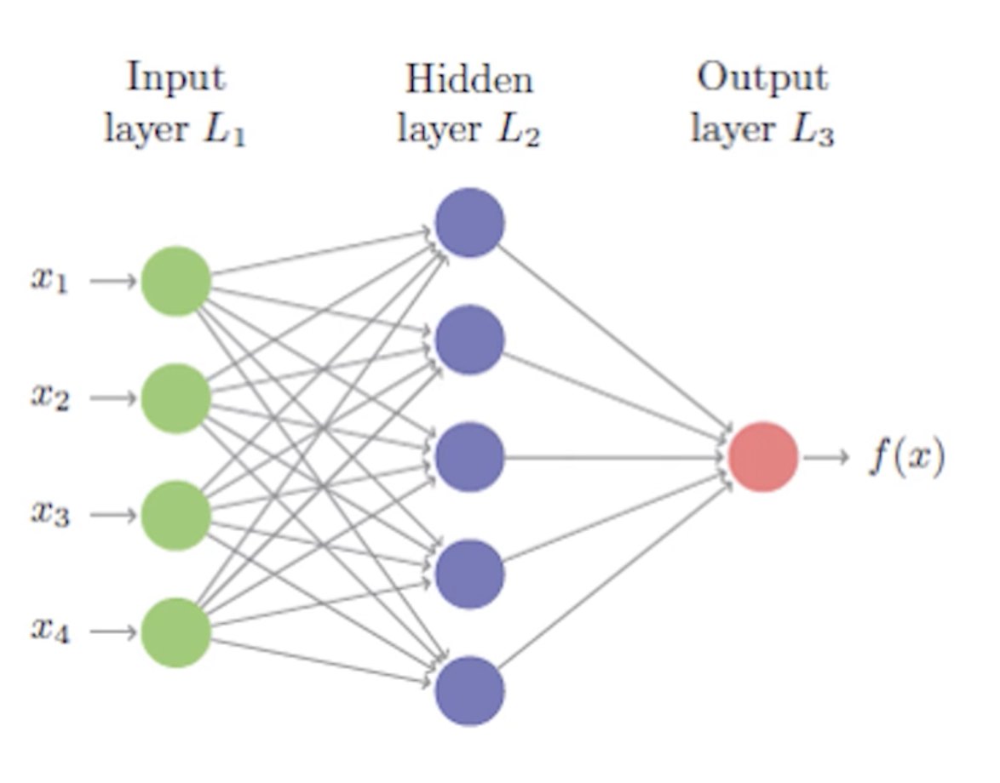
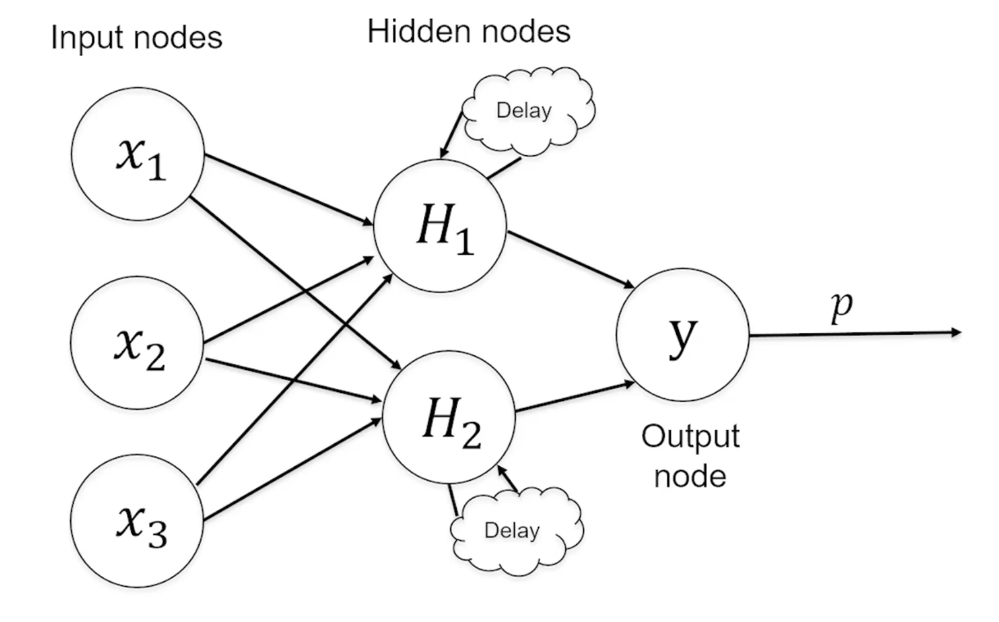
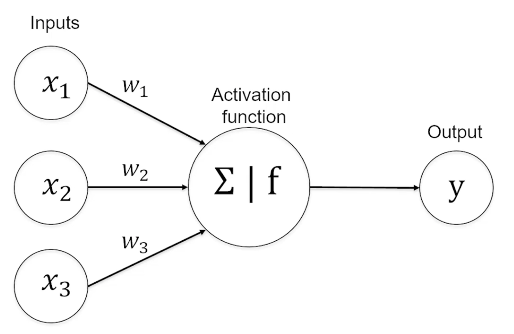
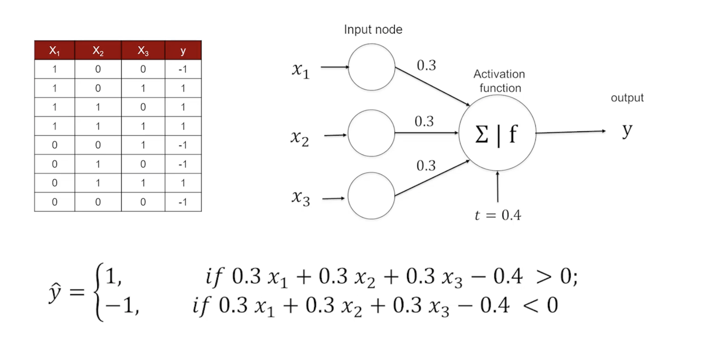

```{r setup, include=FALSE}
knitr::opts_chunk$set(echo = TRUE)
```

# Artificial Neural Networks

## Neural Network Overview

Neural networks are modeled on how our brains respond to sensory input. They use a network of artificial "neurons" or **nodes** to solve a learning problem.

Example applications:

  - Speech and handwriting recognition
  - Models of weather and climate patterns
  - Smart device automation

## Feedforward Neural Network

Also called "Multilayer Perception," composed of connected layers where inputs influence each layer which then influence the final output layer. Feedforward NNs consist of input, hidden, and output layers.

  - Input layer: original features
  - Output: the final function

It requires four components:

- Input data
- Defined network architecture
- Feedback mechanism
- Model training approach
  


## Network Architecture

### Layers and Nodes

These are the building blocks of neural networks that decide how complex the network will be. Layers are considered density, meaning they are all fully connected to all other nodes.

  - More layers = more opportunities to learn about new features
  
**Hidden layers** are the layer between input and output layers. They process the signal from input nodes prior to reaching output node.

Hidden layers are usually **fully connected**: Every node in one layer is connected to every node in other layers.

- Input nodes
  - Receive unprocessed signals from the input data
  - Each input node is responsible for processing a single feature
- Output nodes
  - Uses its own activation function to generate the final prediction
  - Driven by the type of modeling:
    - Regression: one node with continuous numerical output
    - Classification
      - Binary problem: one node with probability of success
      - Polynomial: number of nodes equal to number of classes predicted and the probability of each class
      
### Selecting Number of Layers/Nodes

  - As computational abilities increase, we can increase the number of hidden layers
    - **Deep** neural networks: multiple hidden layers
    - **Deep Learning**: training deep neural networks 
  - Generally 2-5 hidden layers
    - Largely determined by number of functions in the data
    - Nodes per layer is usually $\leq$ the number of functions 
  - More layers and nodes means more computation needed
  - In a feedforward network, the number of nodes in each layer (including output nodes) can be varied and multiple outcomes can be predicted
  - A greater number of neurons makes a model that closely reflects training data
    - May lead to overfitting
  - Use the fewest nodes that result in adequate performance

## Recurrent Network

- Allows the signal to travel in both directions using loops
- Uses **delays** to increase the power
- Rarely used in practice



## Artificial Neuron

- Defines the relationship between the input signal and output signal (y-variable)
- Each signal is weighted ($w_x$) according to their significance
- Signals are passed to an activation function which includes the weighted signals

### Activation Function
- The activation function is the mechanism by which the artificial neuron processes incoming information and passes it throughout the network
- Sums total input to determine whether it meets the threshold to fire a signal to the next layer
  - If yes: it passes on signal (activates)
  - If no: does not 

#### Generalized Function

- The general function $f(x)$ used by all function types

  $y(x) = f(\sum\limits^n_{i=1}w_ix_i)$
  - w: weight of signal x
  - x: the input signals
  - y: the output


#### Common Activation Functions

- Most common is rectified linear unit
  - Usually determining whether there is enough signal to fire (1) or not fire (0)

Linear
$f(x) = x$

Rectified Linear Unit
$f(x) = \begin{cases} 0,  x < 0\\ x, x > 0 \end{cases}$

Sigmoid
$f(x) = \frac{1}{1+e^{-x}}$

### Perception

In the rectified linear unit model below, y is determined by the weighted average of the input data

- In this case all weights are 0.3
- **Bias term**: adjusts the function output based on predetermined bias
  - Represented by t in the model below




# Training Algorithm


# `neuralnet` Package

These examples use a data set of various compositions of concrete. We will try to use some of these features to predict the `concrete$strength`

## Scale Data

`neuralnet` works best with normalized data
- If normally distributed: standardize data
- If not normally distributed: normalize data

Create a normalization function and apply it to our dataset. Running a summary on the original dataframe and the normalized version (`n.concrete`) we can see the normalization was successful.

```{r}
concrete <- read.csv("Data Sets/5.1-Concrete.csv")

# Normalize data
normalize <- function(x){
  return ((x-min(x))/(max(x)-min(x)))
}

n.concrete <- as.data.frame(lapply(concrete, normalize))

summary(n.concrete$strength)
summary(concrete$strength)
```

## Partition data 

75/25 training/testing split

```{r}
# Partition
train <- n.concrete[1:773,]
test <- n.concrete[774:1030,]
```

## The `neuralnet` Package

>Train neural networks using backpropagation, resilient backpropagation (RPROP) with (Riedmiller, 1994) or without weight backtracking

**hidden** argument:

	- a vector of integers specifying the number of hidden neurons (vertices) in each layer
	- The default of hidden layers is 1
	
## Build the `neuralnet` Model

- Train the model with target variable "strength" and 8 other features
- Leave off `hidden` for now which defaults to 1

```{r message=FALSE, warning=FALSE}
#install.packages("neuralnet")
library(neuralnet)
model <- neuralnet(strength~cement + slag + ash + water
                   + superplastic + coarseagg + fineagg + age,
                   data = train)
```

### Plot `neuralnet` Model

The plot reveals:

- Weights of each feature
- A single hidden node
- Bias term weight (circle 1)
- SSE as "Error"
- The number of steps

```{r}
plot(model)
```

## Use `compute()` to Evaluate Model

Apparently a deprecated function but here we are.

`compute(nn object, covariate)`
- `covariate` is a dataframe or matrix containing the variables (features) that had been used to train the neural network.
  - In this case we train 1:8 because feature 9 is our target variable
- A summary of `model_results` (where we stored compute) provides
  - The neurons for each layer in the network
  - net.result which stores the predicted target value
- Store the predicted value in an object (`predicted_strength`)
  - Looking at the net.result in predicted_strength we get a number of predicted values equal to our data set size
  - Because these are numeric predictions and not classifications, we can't use a confusion matrix to evaluate
  - Instead we run a correlation between it and the target value in the test data set 
- The resulting correlation is 0.71 which indicates a strong relationship

```{r}
model_results <- compute(model, test[1:8])
summary(model_results)
predicted_strength <- model_results$net.result
cor(predicted_strength, test$strength)
```

## Adding Hidden Layers to `neuralnet` Model 

- Let's try adding hidden nodes to strengthen our model
- Pass in value to `hidden` argument, we'll do 5

```{r}
model2 <- neuralnet(strength~cement + slag + ash + water
                   + superplastic + coarseagg + fineagg + age,
                   data = train, hidden = 5)
```

### Plot Extra Layer Model

Notice the obvious increase in complexity, but also the lower error and larger number of steps

```{r}
plot(model2)
```

### Evaluate Extra Layer Model

- Notice increased correlation with the test data, from .71 to .75

```{r}
model_results2 <- compute(model2, test[1:8])

predicted_strength2 <- model_results2$net.result
cor(predicted_strength2, test$strength)
```

# `nnet` Package

This example uses credit data from a German bank. Begin by importing and creating a function to transform variables to factors to use for later. 

## Data Prep

```{r}
credit2 <- read.csv("Data Sets/5.0-GermanCredit.csv")
```

Notice the need to preprocess some variables to factors. To do this we'll create a function and pass in the categorical variables.

```{r}
str(credit2)
```

### Factor Transformation Function 

```{r message=FALSE, warning=FALSE}
library(caret)

# Factor transformation function
to.Factor <- function (df, variables){
  for (i in variables){
    df[[i]] <- as.factor(df[[i]])
  }
  return(df)
}
```

Store the variables that need conversion in a vector.

```{r}
var.factors <- c("credit.rating",
                 "account.balance",
                 "previous.credit.payment.status",
                 "credit.purpose",
                 "savings",
                 "employment.duration",
                 "installment.rate",
                 "marital.status",
                 "guarantor",
                 "residence.duration",
                 "current.assets",
                 "other.credits",
                 "apartment.type",
                 "bank.credits",
                 "occupation",
                 "dependents",
                 "telephone",
                 "foreign.worker"
                 )


```

### Data Partition

This time we create separate objects for test feature and class variables. For test features we leave out item 1, the target variable. For the class we include only the that variable

```{r}
part <- createDataPartition(y = credit2$credit.rating, p = 0.6, list = FALSE)
train2 <- credit2[part,]
test2 <- credit2[-part,]                        

test.features <- -test2[,-1]
test.class <- -test2[,1]

#head(test.class)
```

### Data Transformation

```{r}
# Factor transformations
t.train <- to.Factor(df=train2, variables = var.factors)
t.test <- to.Factor(df=test2, variables = var.factors)

# Feature/class transformations
t.feature.test <- t.test[,-1]
t.class.test <- t.test[,1]
#head(t.feature.test)
```


## Build `nnet` Model

### `train()` Function

Part of `caret` library?

>Fit Predictive Models Over Different Tuning Parameters
This function sets up a grid of tuning parameters for a number of classification and regression routines, fits each model and calculates a resampling based performance measure.

- `method` argument allows you to pass in custom model functions, in this case we will use `nnet` which needs to be installed and loaded from `nnet` package
- Attempts several iterations to convert the model 
- Printing the model will show the various models attempted, the decay, accuracy, kappa, and a printout of the best model selected

```{r message=FALSE, warning=FALSE, include=FALSE}
#install.packages("nnet")
library(nnet)
nn.model <- train(credit.rating~., data = t.train, method = "nnet")
```

```{r}
print(nn.model)
```


## Evaluate `nnet` Model

Like before, we feed in our model and the test features. Because this is a classification (credit rating of 1 or 0) we can use a confusion matrix.

Our model performs with 73.25% accuracy

```{r}
nn.prediction <- predict(nn.model, t.feature.test, type = "raw")

summary(nn.prediction)
confusionMatrix(nn.prediction, t.class.test)
```


