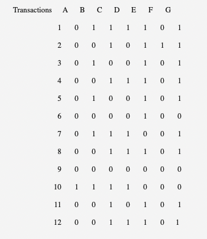

```{r setup, include=FALSE}
knitr::opts_chunk$set(echo = TRUE)
```

# Calculate Support, Confidence, & Lift

>The following data shows the numbers of transactions of a retail store. The manager of the store wants to analyze associations among the transactions shown below:



>The manager found some association rules and wants to figure out their levels of “Support,” “Confidence,” and “Lift.” Specifically, she asks you to:

## a. Rule 1

>Compute “Support,” “Confidence,” and “Lift” for the rule of {C&G} -->{B}

**Support**

$\frac{2}{12} = 0.167$

**Confidence**

$\frac{2}{9} = 0.22$

**Lift**

$\frac{0.22}{0.167} = 1.317$

## b. Rule 2

 >Compute “Support,” “Confidence,” and “Lift” for the rule of {C&E} -->{B}

**Support**

$\frac{1}{12} = 0.083$

**Confidence**

$\frac{1}{5} = .20$

**Lift**

$\frac{0.2}{0.083} = 2.41$


# Association Analysis in R

## Data Prep and Inspection

> The below tasks require you to analyze data using R. R provides a dataset named “Epub.” Help provide some explanation about the following data:  The data contains 15,729 rows and 936 columns.  Inspect the first 10 items, and demonstrate item frequency of the items.

### Inspection 

The Epub data contained in stock R is loaded and inspected below.

```{r message=FALSE, warning=FALSE}
library(arules)
data("Epub")
#summary(Epub)
inspect(Epub[1:10])
```
### Frequency

We can find the frequency of these items as well:

```{r}
itemFrequency(Epub[,1:10])
```


## Build Analysis

>Investigate association rules using the data. You need to set the criteria for “Support” and “Confidence,” and provide your rationale to set the levels of “Support” and “Confidence.”  

First let's try the default parameters of Support = 0.1 and Confidence = 0.8 for `apriori()` 

```{r}
apriori(Epub)
```

This data does not lend itself to any logical rules about the amount of support would make it interesting. The total number of Epubs is $\frac{936}{15729} = 0.06$ = 6% of the number of total transactions, so that should be the absolute maximum.

From here I was left to whittle down a better support number with testing, and I landed on 0.001 or $\frac{1}{10}$th of a percent to get 120 rules. Let's set minimum length to 2 since we'd like to see at least pairs of relationships.

```{r}
epubRules <- apriori(Epub, parameter = list(support = 0.001,
                                               confidence = 0.1,
                                               minlen = 2))
```


## Visualize Analysis

>When you investigate the rules generated by your algorithms, the rules are displayed with some criteria. Sort the association rules by the “Lift,” and visualize the rules using the “arulesViz” package. Provide your interpretation of the output of your visualization. 

# Rule Prep and Inspection

Now that we have our rules, we can save them into a dataframe for sorting. 

```{r message=FALSE, warning=FALSE}
inspect(epubRules[1:10])

erules <- DATAFRAME(epubRules)
lift_erules <- erules[order(erules$lift, decreasing = TRUE),]
lift_erules[1:10,]
```

### Rules Plot

Below the rules are plotted by lift and reduced to 10 rules for useful visibility. Unsurprisingly, several of these associations are between documents that appear sequential. One extremely interesting grouping of rules are the links betwee doc_6e7,8,9 which also have the greatest overall lift values.

```{r}
library(arulesViz)


plot(epubRules[1:10,], method = "graph", measure = "lift", shading = "confidence")
```

