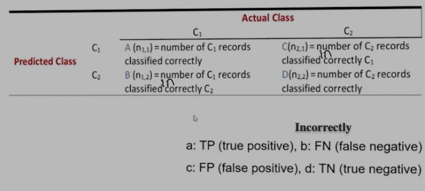
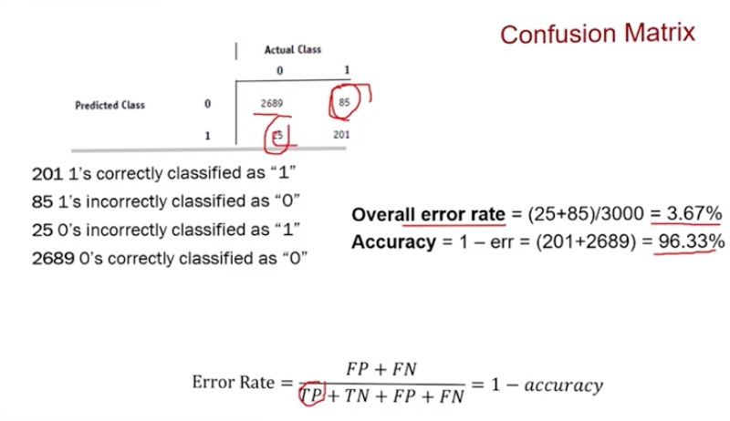
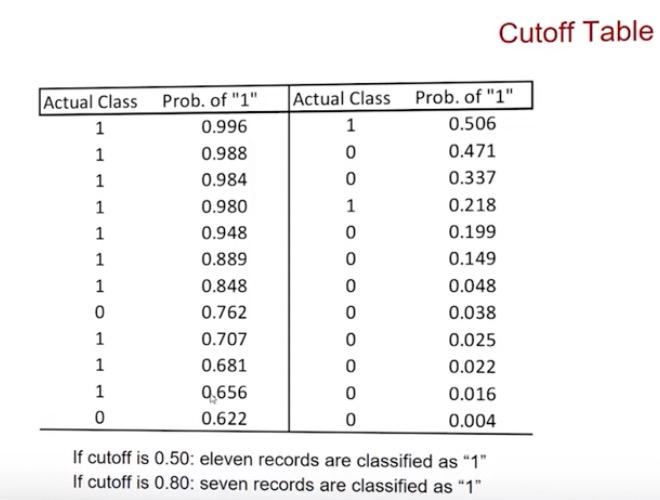
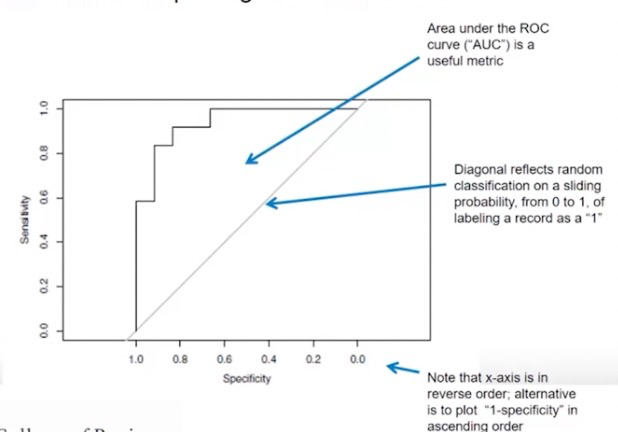

```{r setup, include=FALSE}
knitr::opts_chunk$set(echo = TRUE)
```

# Intro to Machine Learning

> A form of AI that enables a system to learn from data.
>  -IBM

- Supervised learning
	- Prediction of a given output using other variables in the data set
	- Used for tasks involving the prediction of a given output (target, Y variable) using predictor variables (features, X variable) 
	- Finds patterns that can be applied to an analytic process
- Unsupervised learning
	- Performs analysis without target variable
	- Used when the problem requires a lot of unlabled data
	
### X and Y Terminology
- X-Variable
	- Predictor variable
	- Independent variable
	- Attribute
	- Feature
- Y-Variable
	- Target variable
	- Dependent variable
	- Response
	- Outcome Measurement
	
## Basic Processes

### ML Steps
- Define and understand purpose
	- What is the problem statement?
- Get data
	- May involve random sampling
- Clean and process data
	- Ensure data is accurate
	- DS spend 70-80% of time here
- Partition data for generlizability 
	- Generalizeability of our algorithm
	- Fits our past data and predicts the future
- Reduce data
- Specify task
- Choose the techniques
- Iterative implementation and tuning

### Partioning Data for Generalizability
- Split data into training and testing data
- Training data to train algos for choosing the final model
- Testing data for model's performance
- Split recommendations (training%/testing%):
	- 60/40, 70/30, 80/20
	- Splitting can be done in R by sampling portions of data
		- Be sure to use consistent seeds
- Overfitting
	- Doesn't allow us to get a good assessment of training performance
	- Typically with higher traing% splits
- Underfitting
	- Having too little test data to assess our model
	
### Partioning Data in R

*Data: Wisconsin Breast Cancer*

```{r}
# Read in Wisconsin breast cancer data
wis.df <- read.csv("Data Sets/1.2-wisc_bc_data.csv")
```

#### Partition data the easy way
- Knowing the count of observations and feeding those row numbers into separate variables
- Querying dataframes syntax:
  - `dataframe.df[rows,columns]`
  - Leaving either argument blank returns all values 
  - Below we grab specific rows, and all columns because it's blank

```{r}
train <- wis.df[1:469,]
test <- wis.df[470:569,]
```

### Partition data with sampling

#### Create Training Data
> `sample` takes a sample of the specified size from the elements of x using either with or without replacement.

> `sample(x, size, replace = FALSE, prob = NULL)`
  
> `dim` has a method for data.frames, which returns the lengths of the row.names attribute of x and of x (as the numbers of rows and columns respectively)
- Assumption about what's happening because prof didn't explain:
  - Sample the rownames column
  - ...With the size of the length(`dim`) of the first column `[1]`
  - ...Multiplied by 0.7 to get 70%
  
*Create the training data, add it to the dataset*
```{r}
train2.row <- sample(rownames(wis.df),dim(wis.df)[1]*0.7)
# Add training data to the data set
train2 <- wis.df[train2.row,]

# Optional: view train2 to see number of observations
#str(train2)
```

#### Create Test Data
- Use setdiff to get the rows from the first argument that aren't in the second argument
  - In this case the rows in our original df that aren't in the training data

> The elements of setdiff(x,y) are those elements in x but not in y.

```{r}
test2.row <- setdiff(rownames(wis.df),train2.row)
# Add training data to the data set
test2 <- wis.df[test2.row,]
```

## Model Performance Evaluation

### Overfitting
- Causes
  - Too many predictors
  - Too many parameters
  - Trying many different models
    - May wind up picking one that just happens to fit your training data  the best
- Consequence: the deployed model won't work as well with brand new data
### Measuring Predictive Error
- Used for predictive numerical values where the outcome is numerical, e.g. house prices
- Not the same as goodness-of-fit, standard error ($r^2$) (difference between actual and predicted Y, or "error")
  - This merely compares the model to the data it was trained with
  - We are interested in the model's ability to predict new records
    - How do we do that? Witchcraft mostly.
    - Also by validating the error of the training model against the test data
    
### Measure Classifier Performance
For categorical data
- Evaluation
  - Measure the classifier accuracy by dividing the proportion of correct predictions by the total number of predictions
    - The error being misclassification 
- Goals of evaluation models
  - Attempting to understand how model performance will extrapolate to future cases
  - A natural criterion
    - Actual class values
    - Predicted class values
    - Estimated probablity of the prediction 
    
#### Confusion/Misclassification Matrix
- A matrix showing the results between actual and predicted classifications
- Errors (false positive and false negative) are found in $(n_{1,2})$ and $(n_{2,1)})$ 
- Can be used to find the error rate and accuracy




- Note: $(n_{1,2})$ and $(n_{2,1)})$ should read "incorrectly" 

#### Calculating Error Rate and Accuracy
*Error Rate:*
$ErrorRate = \frac{FP + FN}{TP + TN + TP + TN} = 1 - accuracy$

*Accuracy:*
$Accuracy = 1 - ErrorRate$





#### Limitations of Accuracy
Given two groups:
- Group 1 observed 9990 times
- Group 2 observed 10 times

- If a model predicted all 10,000 observations to be group 1, the accuracy would be 9990/10000 = 99.9%
  - This is misleading because the model did not detect any members of group 2
  
##### Cutoff Table



- If the cutoff is 0.5 as indicated by the dividing line, every 1 on the right side and 0 on the left is an error

Use the `confusionMatrix()` function from the `caret` package.
> The caret package (short for Classification And REgression Training) is a set of functions that attempt to streamline the process for creating predictive models.


> [confusionMatrix] Calculates a cross-tabulation of observed and predicted classes with associated statistics.

- `confusionMatrix(data, reference)` 
  - data: the predicted classification
    - In this example we compute the prediction with an if/else and store it as column "Predicted" in "owner" 
      - If the probability is greater than 0.5, classify as owner. Otherwise, classify as nonowner.
    - We need to be sure to cast this new column as a factor so it can be used by `confusionMatrix()`
      - Use `as.factor()`
  - reference: the "actual" classifications 

```{r message=FALSE, warning=FALSE}
#install.packages("caret", repos = "http://cran.us.r-project.org")
```
```{r message=FALSE, warning=FALSE}
library(caret)
```

```{r message=FALSE, warning=FALSE}
owner <- read.csv("Data Sets/1.3-owner.csv")

# Create Predicted classification
owner$Predicted <- ifelse(owner$Probability>0.5, 'owner', 'nonowner')

# Build confusion matrix casting Predicted as a factor
confusionMatrix(as.factor(owner$Predicted), as.factor(owner$Class))

str(owner)
```

## Other Criteria
### Beyond Accuracy
- Useful classifiers balance between predictions that are overly conservative or aggressive
- Sensitivity vs. specificity
  - Sensitivity
    - The ability to detect the important class members correctly
    - E.g. the % of C1 members classified correctly
    $Sensitivity = \frac{a}{a+b}$
  - Specificity
    - The ability to rule out other members correctly
    - E.g. the % of C2 members classified correctly
    $Specificity = \frac{d}{c+d}$
- Precision and recall

### Receiver Operating Characteristic (ROC) Curve
- A method for plotting sensitivity and specificity cutoff values from 1 to 0
  - The x-axis (specificity) is reversed from 1 to 0, you could also write it ascending as 1 - specificity 
- Better performance would be in the top left corner
- Area under the curve (AOC) is a useful metric for judging classifier
  - 1 is a perfect classification
  - .9-1 is excellent
  - .8-.9 is good
  - .7-.8 is fair
  - .6-.7 is poor
  - .5-.6 is failure



#### ROC in R
Install the `pROC` package
> This is the main function of the pROC package. It builds a ROC curve and returns a “roc” object

- Use `roc(response, predictor)` to get a dataframe of ROC points
  - Response is the "true class"
    - In our case `owner$Class`
  - Predictor  is the predicted value of each observation, must match the length of response 
    - In our case `owner$Probability`
- Use `auc()` to obtain the area under the curve value
  
```{r}
#install.packages("pROC")
```
```{r message=FALSE, warning=FALSE}
library(pROC)
```

```{r}
# Read in data
owner <- read.csv("Data Sets/1.3-owner.csv")

# Create roc object and store in r
r <- roc(owner$Class, owner$Probability)

# Plot the roc
plot.roc(r)
```

```{r}
# Obtain the AUC value
auc(r)
```


