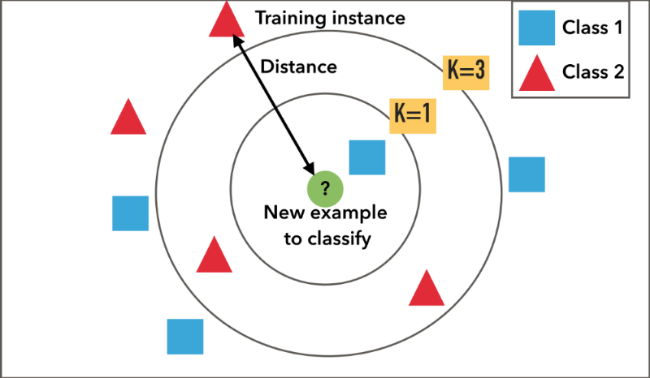

```{r setup, include=FALSE}
knitr::opts_chunk$set(echo = TRUE)
```

# Nearest Neighbor 
The k-NN identifies $k$ number of observations that are similar or nearest to the new record being predicted.
- If $k$ is too small it will be sensitive to noise points
- if $k$ is too large, the neighborhood may include points from other classes

The numbers below are examples of $k$

 

# k-NN in R
## k-NN Example 1

*Data set: Iris species and sepal/petal dimensions*

```{r}
# class package for knn function
library(class) 
data <- iris[,c("Sepal.Length", "Sepal.Width","Species")]
```

### Split the Data Set with Index
#### `sample()` Syntax:
  - `sample(x, size, replace = FALSE, prob = NULL)`
  - Arguments:
    - x: either a vector of one or more elements from which to choose, or a positive integer. See ‘Details.’
    - n: a positive number, the number of items to choose from. 
    - size a non-negative integer giving the number of items to choose.
    - replace: should sampling be with replacement?
    - prob: a vector of probability weights for obtaining the elements of the vector being sampled.

#### Index Split
  - Assign either "train" or "test" to a vector a size of the number of rows (`nrow`) in our data
    - Probability is given in a vector corresponding to 0.67 for train and 0.33 for test
  - From our data we take our index of train/test and the first two columns only since we are trying to predict the third column "Species" 
    - The species columns are instead stored in their own data frames split according to the train/test indexes

```{r}
set.seed(123)

# Create index by generating train/test columns
# size = number of rows of data
# Probability identifies proportion in each index 

idx <- sample(c("train", "test"), size = nrow(data),
              replace = TRUE, prob = (c(0.67, 0.33)))

# Use indexes to place the first two columns into train/test sets 
trainSet <- data[idx == "train", 1:2]
testSet <- data[idx == "test", 1:2]

# Create Species label (column 3) for train and test
data.trainLabels <- data[idx == "train", 3]
data.testLabels <- data[idx == "test", 3]
```

### Build k-NN Classifier
The `knn()` classifier is a function of the `class` package imported above. - `knn()` uses Euclidean distance measures to find the k-nearest neighbor to our new unknown instance
  - For each row of the test set, the k nearest (in Euc distance) training set vectors are found

#### `knn()` Syntax:
`knn(train, test, cl, k = 1, l = 0, prob = FALSE, use.all = TRUE)`

**Arguments:**
- train: matrix or data frame of training set cases
- test: matrix or data frame of test set cases. A vector will be interpreted as a row vector for a single case.
- cl: factor of true classifications of training set (labels)
- k: number of neighbours considered.
- l: minimum vote for definite decision, otherwise doubt. (More precisely, less than k-l dissenting votes are allowed, even if k is increased by ties.)
- prob: If this is true, the proportion of the votes for the winning class are returned as attribute prob.
- use.all: controls handling of ties. If true, all distances equal to the kth largest are included. If false, a random selection of distances equal to the kth is chosen to use exactly k neighbours.

```{r}
pred <- knn(train = trainSet, test = testSet, cl = data.trainLabels, k = 3)
```

### Evaluate k-NN Model
#### Evaluation with CrossTable
`CrossTable()` requires `gmodels` library
- We perform this crosstable using the actual species labels in `data.testLabels` and our predicted species in `pred`
- The output shows us how many labels our model got correct
  - E.g. the versicolor row in `data.testLabels` shows that our model correctly identified 8 as versicolor and incorrectly identified 6 as virginica

```{r}
#install.packages("gmodels")
library(gmodels)
CrossTable(x = data.testLabels, y = pred)
```

#### Evaluation with Confusion Matrix
`confusionMatrix()` requires `caret` library
- Similar process as above inputting the testLabels and our model
- The output shows an accuracy of ~0.755 or 75.5%
```{r}
#install.packages("caret")
library(caret)
confusionMatrix(data.testLabels, pred)
```


## k-NN Example 2

*Data set of house attributes with remodel y/n classifications*

### Partition Data
- We use `sample()` to assign 60% of values to train passing as arguments:
  - The rows in the dataset using `row.names()`
  - 0.6 * the length `dim()` of the dataset
- Use `setdiff()` to assign the remaining values to test by passing in:
  - The rows in the original dataset
  - The vector we want the difference from
- Then we create a dataframe using the indexes and pulling the rest of 'housing.df' back in

```{r}
housing.df <- read.csv("Data Sets/2.1.1-Roxbury.csv")

library(caret)

# Create index of train and test row names
train.index <- sample(row.names(housing.df), 0.6*dim(housing.df)[1])
test.index <- setdiff(row.names(housing.df), train.index)

# Use those indexes to create a df of all attributes split between train and test
train.df <- housing.df[train.index, ]
test.df <- housing.df[test.index, ]

#str(housing.df)

# Duplicate df to use for normalization
train.norm.df <- train.df
test.norm.df <- test.df
```

#### Normalize with `preProcess()`
- Using "center" and "scale" method arguments we can calculate the z-score
- Reminder the result will have a mean of 0 and variance of 1
```
install.packages("caret")
preProcess(
  x,
  method = c("center", "scale"),
  thresh = 0.95,
  pcaComp = NULL,
  na.remove = TRUE,
  k = 5,
  knnSummary = mean,
  outcome = NULL,
  fudge = 0.2,
  numUnique = 3,
  verbose = FALSE,
  freqCut = 95/5,
  uniqueCut = 10,
  cutoff = 0.9,
  rangeBounds = c(0, 1),
  ...
)
```
**Arguments:**

- Only for this example, check docs for the rest

- **x:** 	
a matrix or data frame. Non-numeric predictors are allowed but will be ignored. 

- **method:** a character vector specifying the type of processing. Possible values are "BoxCox", "YeoJohnson", "expoTrans", "center", "scale", "range", "knnImpute", "bagImpute", "medianImpute", "pca", "ica", "spatialSign", "corr", "zv", "nzv", and "conditionalX"
  - method = "center" subtracts the mean of the predictor's data (again from the data in x) from the predictor values
  - method = "scale" divides by the standard deviation.

```{r}
# Normalize data
norm.values <- preProcess(train.df[, 1:3], method = c("center", "scale"))
train.norm.df[, 1:3] <- predict(norm.values, train.df[, 1:3])
test.norm.df[, 1:3] <- predict(norm.values, test.df [, 1:3])
#str(test.norm.df)
```

### Run and evaluate the k-NN Model
- Like above, we will create an accuracy dataframe and loop through the model using several k values in a rang
  - In this case 1-15
- Ensure that confusionMatrix data is cast as a factor rather than a character
```{r}
# Simple classification with k = 3
library(class)
knn(train = train.norm.df[, 1:3], test = test.norm.df[,1:3],
    cl = train.norm.df[,4], k = 3)

#str(knn)

# Initialize a data frame with columns k and accuracy
accuracy.df <- data.frame (k = seq(1, 15, 1), accuracy = rep(0,15))

# Calculate range of k-values to see which validate the best 
# Loop i-k
for (i in 1:15) {
  knn.pred <- knn(train.norm.df[, 1:3], test.norm.df[,1:3],
    cl = train.norm.df[,4], k = i)

  accuracy.df[i, 2] <- confusionMatrix(knn.pred, factor(test.norm.df[, 4]))$overall[1]
}

# View accuracy data frame
print(accuracy.df)

```

From this list we see that k = 15 gives us the most accurate output.
