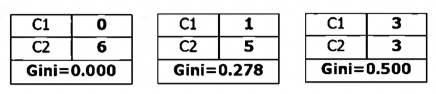
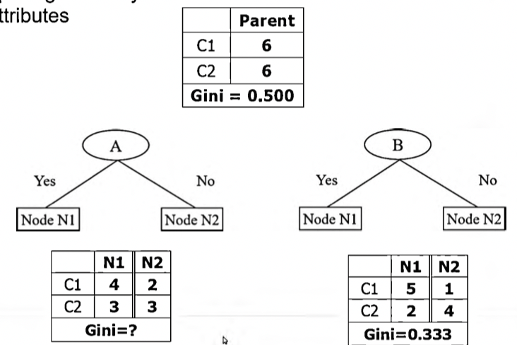
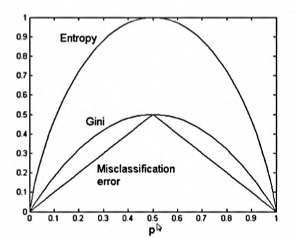
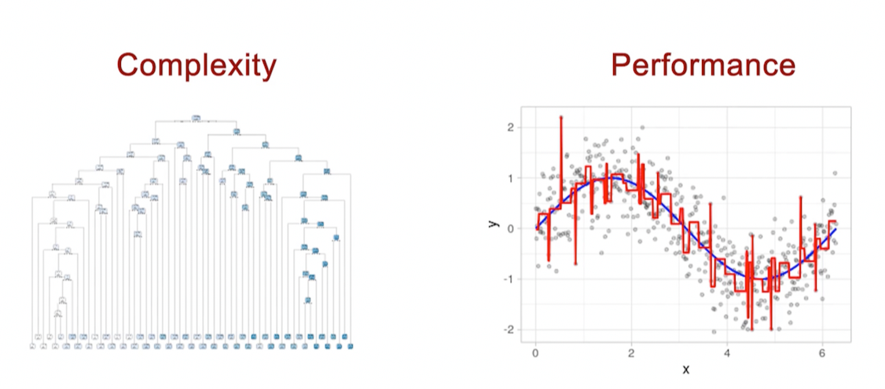

```{r setup, include=FALSE}
knitr::opts_chunk$set(echo = TRUE)
```

# Decision Tree Overview

Decision trees are classifiers that use a tree structure to model the relationships among the variables and potential outcomes

- The primary challenge of decision trees is figuring out which feature/class to split on
- Purity: the degree to which a subset of examples contains only a single class/feature
- Pure: a subset composed of a single class

## Tree Components
- Root node: the first group with all of the training data
- Decision or internal node: Require choices to be made on the attributes of the job
  - The data is split across branches that indicate the poential outcomes of the decision
- Terminal or leaf nodes: the final subgroups
- The key problem to evaluate is the effectiveness of the splitting

  $p(i:t)$
  
  i = feature or class
  t = node
  
## Indices
## GINI Index
- Measures *impurity*, or how dissimilar the class labels are for the data instances belonging to a common node 

$1 - \sum\limits_{i=0}^n$

- i - class
- t = node
- $p_i(t)$ is the relative frequency of class $i$ at node $t$
- c is the total number of classes 

Maximum: $1 - \frac{1}{n_c}$
- Records are equally distributed among all classes
- Least interesting information 
Minimum: (0) 
- All records belong to one class
- Most interesting information



### Splitting

$GINI_{split} = \sum\nolimits \frac{k}{i=1} \frac{n_i}{n} GINI(i)$
- $n_i$ is the number of records at child i
- $n$ is the number of records at node p

#### Splitting of Binary Attributes
Solve the Gini index for A


Gini for Node N1:
$1-(\frac{4}{7})^2-(\frac{3}{7}^2) = 0.4898$

Gini for Node N2:
$1-(\frac{2}{5})^2-(\frac{3}{5}^2) = 0.48$

Gini for Entire Split:
$\frac{7}{12} * 0.4898 + \frac{5}{12} *0.48 = 0.485$

## Entropy
- Quantifies the randomness or disorder within a set of class values
- Sets with high entropy are very diverse 
  - Gives us little information about other items that may also belong in the set
  - No apparent commonality
- The goal is to find splits that reduce entropy, or increase homogeneity within the groups 
- For $n$ classes, entropy ranges from 0 to $\log_2(n)$
  - Minimum value indicates that the sample is homogenous
  - Max value indicates the data are as diverse as possible

$-\sum\limits^{c-1}_{i=0}p_i(t)\log_2p_i(t)$

- $c$ = Number of class levels
- $p_i$ = Proportion of values in class level $i$

### Information Gain
A measure of the change in homogeneity that would result from a split on each possible feature
- Calculated as the difference between the entropy in the segment before the split and the partions resulting from the split

$InfoGain(F) = Entropy(S_1)-Entropy(S_2)$
- $F$ = Feature
- $S_1$ = The unsplit set
- $S_2$ = Partitions resulting from the split
  - This is divided into more than one partition
  - To consider the total entropy across all partitions, it weights each partition's entropy by the proportion of records falling into each one
  - See ML with R - Brett Lantz pp. 133
  

## Misclassification Measure (Classification Error)
Classification Error = $1 - \max\limits_{i}[p_i(t)]$

- Measures misclassification error made by a node
- Maximum $(1-\frac{1}{n_c}$
  - When records are equally distributed among all classes
  - Least interesting
- Minimum (0.0)
  - When records all belong to one class
  - Most interesting information

## Splitting Method Comparison


## Pruning
If a decision tree grows too large, many of the decisions will be overly specific to the data 
- This causes overfitting, or poor generalization 
- **Pruning:** Reducing the size of a tree such that it generalizes better to new data



### Early Stopping
Pre-pruning a tree by restricting it from splitting further once it reaches a certain number of decisions 
- Minimum terminal node size
- May miss important patterns that would have been found in a larger tree

## Post-Pruning
- Growing a tree too large then pruning leaf nodes back to find the optimal final tree
- Find a cost complexity parameter
  - $\min{SSE + α|T|}$
  - I have no idea what this means

# C5.0 Tree Algorithm
- Industry standard for producing decision trees 
- Uses entropy, explained above 
- Post-prunes by removing nodes and branches that have little effect on classification errors

# Cross Validating a Classification Tree
- Two-fold method
  - Split training data into two partitions (folds)
  - Run the tree with one fold as train and the other as test, then flip the test/train label and run it again
  - Average the performance
- K-fold
  - Same concept but split into $k$ number of folds
  - Each iteration, one fold is a test while the others are trains
  - Run the model $k$ number of times so each fold is a test once 

# CART Algorithm
Classification and Regression Tree (CART)
- Another tree algorithm 
- Who cares about specifics let's get goin

## Data Prep
Data set: Heart health database
  - We are trying to predict alveolar hydatid disease (AHD)
  - Specifically we will use AHD.f which is factored
  
Fire up that caret package and create your data partitions babyyy 
```{r}
library(caret)
set.seed(123)
heart <- heart[,-1]
partition <- createDataPartition(y = heart$AHD, p = 0.7, list = FALSE)
heart$AHD <- factor(heart$AHD)
#heart <- subset(heart, select = -c(AHD.f))

train<- heart[partition,]
test <- heart[-partition,]
str(train)
```

## Build the Model
Using the tree library we will build out the decision tree

### `tree` Function
```
tree(formula, data, weights, subset,
     na.action = na.pass, control = tree.control(nobs, ...),
     method = "recursive.partition",
     split = c("deviance", "gini"),
     model = FALSE, x = FALSE, y = TRUE, wts = TRUE, ...)
```
**Arguments:**
- formula: The left-hand-side (response) should be either a numerical vector when a regression tree will be fitted or a factor, when a classification tree is produced. The right-hand-side should be a series of numeric or factor variables separated by +; there should be no interaction terms. Both . and - are allowed: regression trees can have offset terms.
- data: A data frame in which to preferentially interpret formula, weights and subset.
- weights: Vector of non-negative observational weights; fractional weights are allowed.

### Model
- We examine our factored AHD column with the rest of the columns as factor variables
- `plot` creates the tree but it has no labels until we add
- `text` which adds text labels to the tree

```{r}
#install.packages("tree")
```

```{r}
library(tree)
treemod <- tree(AHD~., data = train)
plot(treemod)
text(treemod)
```

## Classification Tree
The classification tree will give us the misclassification or variance of various-sized trees to help us select the best size for pruning
- Size in this case refers to number of terminal nodes

### `cv.tree` Function
Runs a K-fold cross-validation experiment to find the deviance or number of misclassifications as a function of the cost-complexity parameter k.

```
cv.tree(object, rand, FUN = prune.tree, K = 10, ...)
```
- object: a tree object
- rand: Optional number of cases used to create object to assign cases to different groups (?)
- FUN: the pruning function
- k: number of folds for k-fold cross validation

### The Model

```{r}
cv.trees <- cv.tree(treemod, FUN = prune.misclass )
plot(cv.trees)
```

### `prune.misclass` function
Determines a nested sequence of subtrees of the supplied tree by recursively “snipping” off the least important splits. This is an abbreviation for `prune.tree(method = "misclass")`

```
prune.misclass(tree, k = NULL, best = NULL, newdata, 
               nwts, loss, eps = 1e-3)
```
**Arguments:**
- tree: tree object
- k: cost-complexity parameter defining either a specific subtree of tree (k a scalar) or the (optional) sequence of subtrees minimizing the cost-complexity measure (k a vector). If missing, k is determined algorithmically.
- best: integer requesting the size (i.e. number of terminal nodes) of a specific subtree in the cost-complexity sequence to be returned. This is an alternative way to select a subtree than by supplying a scalar cost-complexity parameter k. If there is no tree in the sequence of the requested size, the next largest is returned.

## Pruned Tree
- Based on the classification tree above, we see the lowest misclassifcations around 5
- For this example we went with 6 as `best`

```{r}
prune.trees <- prune.misclass(treemod, best = 6)
plot(prune.trees)
text(prune.trees, pretty = 0)
```

## Predict and Evaluate
### `predict()` Function
Creates a vector of predicted class values which can be compared to the actual class values (`test`)

We then create a confusion matrix of our predictions and test

Our model isn't very good.

```{r}
library(e1071)
treepred <- predict(prune.trees, test, type = "class")
confusionMatrix(treepred, test$AHD)
```

# Rpart Algorithm

```{r}
library(rpart)
rpartmod <- rpart(AHD~., data = train, method = "class")
plot(rpartmod)
text(rpartmod)
```

## Pruning Rpart
I'm not sure what went wrong here but know that I'm very sorry

```{r}
printcp(rpartmod)
ptree <- prune(rpartmod, cp =  rpartmod$cptable[which.min(rpartmod$cptable[,"xerror"]),"CP"])
plot(ptree)
text(ptree)
```

## Evaluating RPart
This would make more sense if my Rpart wasn't broken. Nevertheless, we persisted.

```{r}
library(e1071)
rpartpred <- predict(ptree, test, type = "class")
confusionMatrix(rpartpred, test$AHD)
```

# Party Algorithm!!
Please acompany this section with "Let's Groove Tonight" by Earth, Wind, and Fire.

```{r}
library(party)
partymod <- ctree(AHD~., data = train)
plot(partymod)
```

## Evaluate your Party
```{r}
partypred <- predict(partymod, test)
confusionMatrix(partypred, test$AHD)
```

