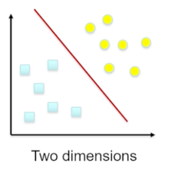
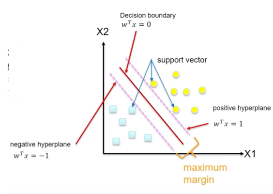
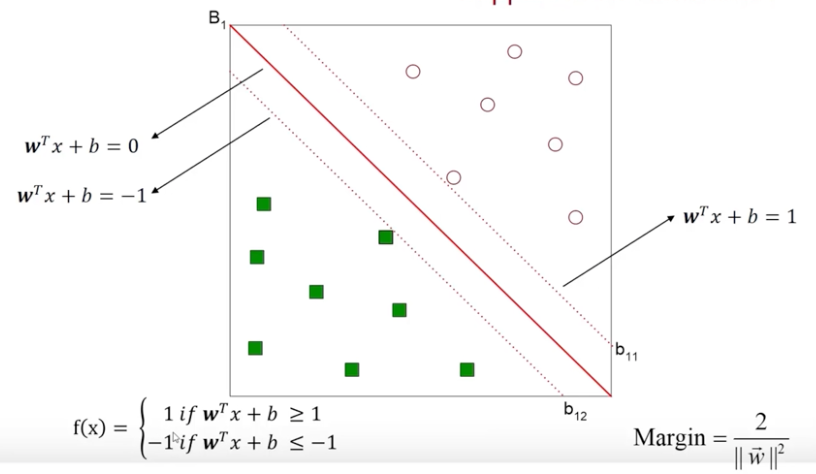
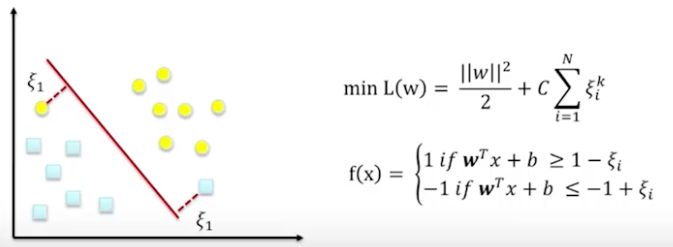
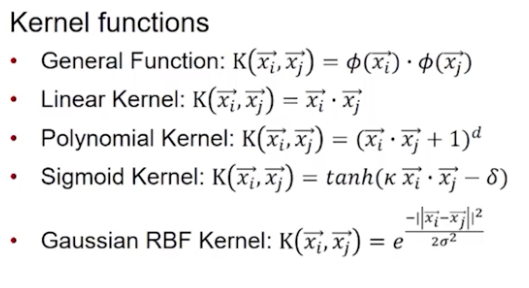
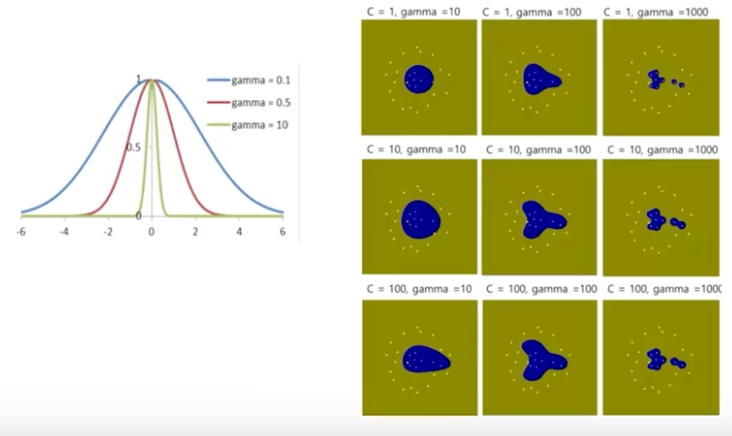

# Support Vector Machines (SVM) Overview

A support vector machine (SVM) is a discriminatory classifier that attempts to find a hyperplane in an N-dimensional space (N = features) that distinctly classifies the data

## Hyperplane
A decision boundary that (ideally) divides our data points into similar class values

  - In 2D space, the hyperplane is a line separating two classes
  - How do we pick the line? One option is a maximal margin classifier



**Maximal Margin Classifier**: Attempts to maximize the distance between the hyperplane and the nearest points (observation points, support vector)

  - This distance is referred to as the **margin**
  
**Support Vector**: The nearest points to the maximum-margin hyperplane, also called observation points

  - Each class will have at least one support vector
  - The algorithm to determine the support vectors relies on vector geometry




## Linearly Separable Classes
In n-dimensional space:

$w^Tx+b = 0$

- x: the attribute
- w, b: parameters of the hyperplane
- There can be infinite hyperplanes that will all divide the data correctly, but only one maximizes the margin


## Nonlinearly Separable Classes

- **Slack Variable**: A soft margin that allows some points to fall on the incorrect side of the margin

  - Instead of maximizing the margin, the algorithm attempts to minimize total cost of the slack variables with a cost parameter

### Cost Parameter
- Modifying the cost parameter adjusts the penalty for falling on the wrong side of the hyperplane
- Determines the extent to which data samples are allowed to be placed in different classes
- A greater cost parameter will make a narrower margin
  - Lower probability of an anamoly
  - Not as "soft" of a margin
- A lower cost parameter emphasizes a wider margin
  - If it is too low there is a high risk of over-conformity


### Kernel Trick

- Modifies nonlinear relationships by raising their dimension(s) to make it linear
- For example, plotting each data point against it's square
  - Raises the dimension from 1D (line) to 2D
- Requires you to specify the value of the cost parameter (threshold/penalty/violation )
- Can be slow to run



 - General function: returns dot product providing a single number
 - Linear kernel: does not transform all data 
 - Polynomial kernel: Nonlinear transformation of data
 - Sigmoid kernel: Uses sigmoid activation function
 - Gaussian RBF Kernel: Widely used, similar to neural network? 
 
#### Gaussian Kernel and Gamma
- Requires two parameters: gamma and C (cost)
- **Gamma**: Determines the distance at which one data point exerts influence on another
  - Related to standard deviation of Gaussian function
    - The larger the standard deviation, the smaller the gamma and therefore the shorter the distance of influence
    - The larger the gamma, the longer the distance a data point exerts influence
  - Determines the curvature of the decision boundary
- The larger the C, the lower the probability of the presence of an anomaly
- The larger both values are, the more complex the algorithm is



# Support Vector Machines in R - Iris Example

## `svm()` Function

```
svm(formula, data = NULL, ..., subset, na.action =
na.omit, scale = TRUE)
```


### Arguments

**type**

>svm can be used as a classification machine, as a regression machine, or for novelty detection. Depending of whether y is a factor or not, the default setting for type is C-classification or eps-regression, respectively, but may be overwritten by setting an explicit value.

  - C-classification
  - nu-classification
  - one-classification (for novelty detection)
  - eps-regression
  - nu-regression
  
**kernel**

>the kernel used in training and predicting. You might consider changing some of the following parameters, depending on the kernel type.

  - linear:
    $u'*v$
  - polynomial:
    $(gamma*u'*v + coef0)^degree$
  - radial basis:
    $exp(-gamma*|u-v|^2)$
  - sigmoid:
    $tanh(gamma*u'*v + coef0)$
    
**cost**

>cost of constraints violation (default: 1)—it is the ‘C’-constant of the regularization term in the Lagrange formulation.

**gamma**

>parameter needed for all kernels except linear (default: 1/(data dimension))

For this model, we use the default type of C-classification and `kernel = "radial"` to indicate Gaussian RBF kernel

- The default cost is 1, we can change it to a few different things to test the outcome
- The default gamma is 1 divided gamma dimensions (wtf?)

## Running SVM

```{r}
library(e1071)

irisSVM <- svm(formula = Species~., data = iris, type = "C-classification",
               kernel = "radial", cost = 10, gamma = 0.1)
summary(irisSVM)
```

## Interpreting the SVM Model

The call and parameters are what we entered. The model identified 32 support vectors, and 3 classes of species

### Plotting SVM Model Outcomes

The plot shows the species predicted by color with the data points they contain. A few misclassifications are evident, especially near the versicolor and virginica border.

```{r}
plot(irisSVM, iris, Petal.Width~Petal.Length,
     slice = list(Sepal.Width = 3, Sepal.Length = 4))
```

## Evaluating SVM

```{r}
pred <- predict (irisSVM, iris)
table( pred, iris$Species)
```

# Advanced SVM in R - OCR

## OCR Data Overview

Example data: UCI Machine learning

- Image data is noisy, and recognizing images are much easier for humans than machines
- SVMs are particularly good for this task because they tolerate noise better
- This example will be similar to how optical character recognition (OCR) works
- Contains 20,000 examples of 26 English alphabet capital letters as printed using 20 different reshaped and distorted black fonts 
- Each stimulus is converted into 16 numerical attributes (statistical moments and edge counts) fit into a range of integers from 0-15
- Typically 16/20 split

### Loading and Prepping Data

Recall that **SVMs require features to be numeric**
- In this case we have all integers so there are no conversions necessary 
- May also need to be normalized or scaled if the specific package doesn't do this for you

```{r}
letters <- read.csv("Data Sets/5.0-Letters.csv")
letters$letter <- factor(letters$letter)
str(letters)
```

### Create Training and Testing Data 

- We will train with 80% of the data, 20% test
  - Data has already been randomized so we can enter the ranges directly
  - Notice `head(test)` starts at record 16001

```{r}
train <- letters[1:16000,]
test <- letters[16001:20000,]
head(train)
```

## `ksvm()` from `kernlab` Package
- kernlab is developed native in R rather than C or C++ like other packages
  - Can also be used with caret package we are familiar with to train and evaluate SVM

### Kernels Overview

>A kernel function k calculates the inner product of two vectors x, x ′ in a given feature mapping Φ : X → H. Package kernlab includes 7 different kernel classes which all contain the class kernel and are used to implement the existing kernels.

Two of these kernels are used in this example:
- The linear `vanilladot` kernel implements the simplest of all kernel functions which is useful specially when dealing with large sparse data vectors x as is usually the case in text categorization.
    
    $k(x, x ′ ) = 〈 x, x ′〉$

- The Gaussian radial basis function `rbfdot` which is a general purpose kernel and is typically used when no further prior knowledge is available about the data.

    $k(x, x ′ ) = exp(−σ ∥ x − x ′ ∥ 2 $)
    
## Build Linear Kernel SVM (`vanilladot`)

**Arguments**
- Target variable, data, kernel = vanilladot, cost
  - We skip cost function here which sets the default c = 1 

```{r}
library(kernlab)

# Vanilladot SVM
vSVM <- ksvm (letter~., data = train,
              kernel = "vanilladot")

# Print output
vSVM
```

### Interpret Linear SVM
- The model identified 7037 support vectors and printed them
- There is a trianing error of 13%
- To know more, we need to evaluate against our test data

### Evaluate Linear SVM
- Pass in model data and test data, create a table to display the prediction
- The diagonal values in the table are the total number of records where the predicted letter matches the true value
- The number of mistakes are listed outside of the diagonal
  - Rows: Prediction
  - Columns: True value in test dataset
  - E.g. Column D row B indicates 5 cases where the letter D was misidentified as B

```{r}
myPredictions <- predict(vSVM, test)
head(myPredictions)
table(myPredictions, test$letter)
```

#### Calculate Linear Kernel Accuracy
- Ignores the types of error, only considers whether predictions were correct or incorrect
- Create a table to return how often the prediction equals the test value
- Create a proportion table to show the rate

**Model success rate: 83.9%**

```{r}
agreement <- myPredictions == test$letter
table(agreement)
prop.table(table(agreement))
```

## Build Gaussian Kernel Model (`rbfdot`)

The last model wasn't very accurate, we can try a more complex kernel
- Gaussian is a popular convention that has been shown to perform well
- May take a while, this is a more complicated algorithm

```{r}
# RBFdot SVM
rbfSVM <- ksvm(letter~., data = train, kernel = "rbfdot")
rbfSVM
```

### Evaluate Gaussian Kernel SVM

- Our overall accuracy increased from 84% - 93% 

```{r}
rbfPredictions <- predict(rbfSVM, test)
head(rbfPredictions)
table(rbfPredictions, test$letter)
```

#### Calculate Gaussian Accuracy

**Success Rate: 93%**

```{r}
rbf_agreement <- rbfPredictions == test$letter
table(rbf_agreement)
prop.table(table(rbf_agreement))
```


