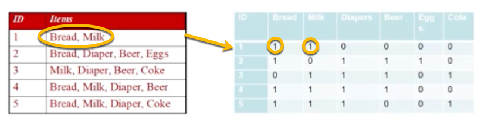
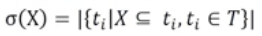
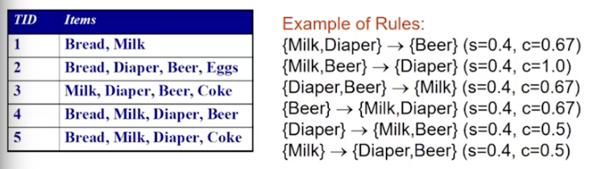
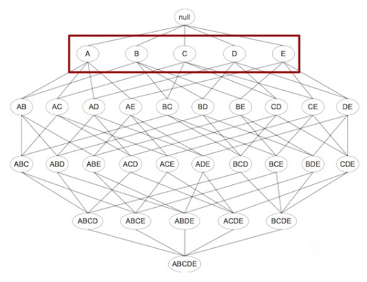
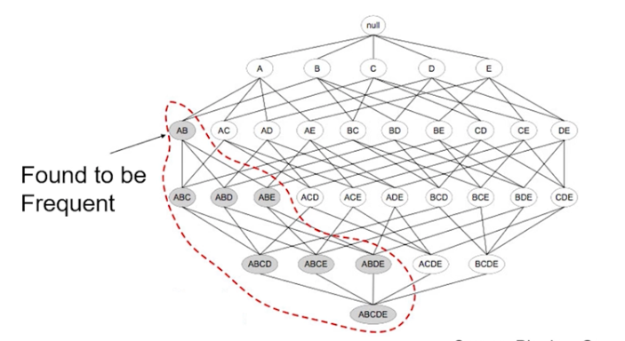
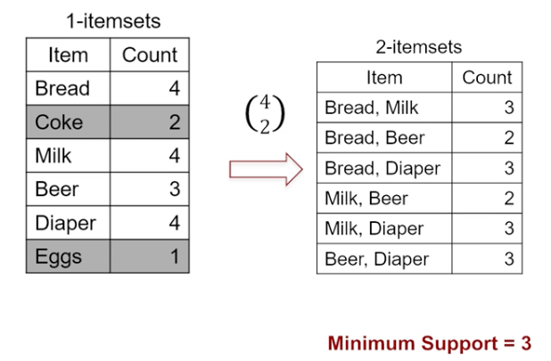

```{r setup, include=FALSE}
knitr::opts_chunk$set(echo = TRUE)
```

# Association Analysis Overview

- Also called **market basket analysis**, association analysis is attempts to discover attributes that "go together" in large data sets
- Attempts to find association rules that define the relationships between the pairs

## Association Rule Mining

- Used for unsupervised knowledge discovery, not for prediction
  - As opposed to classification and numeric production algorithms
- Benefits: no need to train algorithm or label data
- Drawback: There is no easy way to objectively measure the performance besides evaluating for its qualitative usefulness
- Mostly used to look for useful or interesting relationships among a large collection of elements
- Primarily driven by two measures: **support** and **Confidence** measures


### Binary Table

Market basket analysis can be represented with a binary table
  - Each row represents a transaction in each column corresponds to an item 
- Transactions can be represented as a binary variable;:
  - 1: If it is represented in the transaction
  - 0: If it's not


### Notation and Terminology

$I = { i_1, i_2, … , i_d}$

- The set of all items (columns) in the data

$T = { t_1, t_2, … , t_N} $

- The set of all transactions (rows)

### Itemset

A collection of one or more items.
  - Example {Milk, Bread, Beer}

**k-itemset**
- Item set with $k$ number of items

## Association Rules

- Composed subsets of items in item sets
- Relates an item on the left-hand side of the rule to the item on the right hand side of the rule
- These rules take on the logical format: "if *antecedent* then *consequent*"
  - Example: {diaper} $\rightarrow$ {beer}
    - Customers who buy diapers likely also buy beers
  - The item on the left is the condition that triggers the rule. The item on the right is the expected result of the condition being met
- An implication expression where itemsets X and Y have the relationship $X \rightarrow Y$
  - E.g. ${Milk, Diaper} \rightarrow Beer$

Association rules are evaluated with two metrics: support (s) and Confidence (c)  
  
## Support Measure (s)

A fraction of the transactions that contain boy X and Y itemsets 

### Support Count δ

The support count (σ) is the frequency of occurrence in an itemset. In the example above, the support count of {Milk, Bread, Diaper} is 2, because only two occurences in the itemset have all three variables


(Authors note: I promise I tried to LaTex the formula but these symbols eluded me)



E.g.: σ({Milk, Bread, Diaper}) = 2 

- | |  denotes the number of elements in a set

### Support

Determines how often rule is applicable to a given data set 

Fraction of the transactions that contain both of the itemsets X and Y

- Given rule: s({Milk, Bread, Diaper})
  - Support =
  
  $\frac{2}{5} = 0.4$
  
- Out of 5 transactions in our data set, two transactions contained this rule
  - In the data above this is transaction 3 and 4

## Confidence Measure (c)

Confidence (c) measures how often items in itemset Y appear in transactions that contain itemset X
 
Given our association rule:

${Milk, Diaper} \rightarrow Beer$

- {Milk, Diaper} = X
- {Beer} = Y
- How often items in Y (Beer) appear in transactions that contain X (Milk, Diaper)
- Only two cases of X (Milk, Diaper) appear out of the three cases containing Y (Beer)
- Our confidence level would be:

$c = \frac{2}{3} = 0.67$

## Purpose of Association Rule Metrics

Trying to accomplish **rule mining task discovery**

- Given a set of transactions T, the goal of association mining is to find rules with
  - Support $\geq$ minimum support threshold
    - A rule that has very low support may occur by chance more frequently
    - Useful for eliminating uninteresting rules
  - Confidence $\geq$ minimum confidence threshold
    - Measures the reliability of the inference made by a rule
    - The more likely it is for y to be present in transactions that contain x 
    - An estimate of the conditional probability of y given x
- Inferences do not necessarily imply causality 
  - It only implies a strong cooccurrence relationship between items in the antecedent and consequent of the rule
- Algorithms trying to compute the support and confidence for every possible rule
  - There are exponentially large number of rules that could be extracted, so this is prohibitively expensive
  
## Evaluating Calculations 



Observations we can make from these calculations:

- All of the generated rules are binary partitions of the itemset {Milk, Diaper, Beer}
- Rules that come from the same items that have the same support metrics but can have different confidence metrics
  - If support and confidence thresholds are taken together these would be pruned early even if they may be useful
  - It is useful to take up all the support and confidence thresholds

## Determining Rule Count

The number Of possible rules (R) in a data set is equal to:

$R = 3^d - 2^{d+1} + 1$

- d = number of items
- The example dataset with 6 items could generate 602 rules
- A lot of these can be discarded by applying minimum support and confidence thresholds

### Two Step Approach

Considered strong rules, but frequent itemset generation is still computationally expensive.

1. **Frequent itemset generation**: Generate all itemsets with *support* above the minimum threshold 
2. **Rule generation**: From the remaining frequent itemsets, generate high confidence rules
  - Each rule is a binary partition of the frequent itemset
  
# A Priori Analysis Overview

## Itemset Lattice

These are used to represent all possible itemsets. The example below shows the itemset lattice for "A, B, C, D, E"

- A dataset with $k$ items can generate a $2^{k-1}$ frequent itemset
- This is a huge amount of items to process in order to generate a frequent itemset
- One approach to handling this is A-Priori Analysis



### Choose notation

A method for describing how many combinations are possible. If we have 6 items and can choose 2 of them, how many combinations are implied? We ask this in the format "6 choose 2" or $6 \choose 2$

The calculations are done in iterations:

- In the first iteration, each of the six items are considered as candidates that generates six total itemsets (one each)
  - Denoted 6 *choose* 1 $6 \choose 1$
- In the next round, two items are considered generating 15 different itemsets 
  - $6 \choose 2$
- In the third round, three itemsets are considered generating 20 itemsets 
  - $6 \choose 3$
  
Obviously this becomes an impossible calculation pretty quickly, so we use a smart rule learning algorithm.

## A Priori Principle

A method for reducing the number of candidate itemsets ntroduced by Agrawal and Srikant in 1994. The basic principle is that if we observe a frequent itemset, the subsets of that itemset must also be frequent. This allows us to dramatically reduce the frequency itemset calculation.

Logically, we can think of market basket analysis ruling out the likely co-occurrence of a purchase of bananas and new tires. 



In this example, instead of $6 \choose 2$ we can set a support threshold on the first iteration and reduce our calculation to $4 \choose 2$.



# Association Analysis in R

## `apriori()` Function

From `arules` package

>Mine frequent itemsets, association rules or association hyperedges using the Apriori algorithm. 

```
apriori(data, parameter = NULL, appearance = NULL, control = NULL)
```
### Parameter Argument

Where we can pass in a list of parameters to include the support, confidence, and minimum length

> Object of class APparameter or named list. The default behavior is to mine rules with minimum support of 0.1, minimum confidence of 0.8, maximum of 10 items (maxlen), and a maximal time for subset checking of 5 seconds (maxtime).

## The `arules` Groceries Data Set

This example uses the Groceries data set built into the `arules` package. Here are some takeaways we can observe below:

- Most of our previous data used matrices with rows as example instances and columns as features
- Transactional data is a little looser and needs to be handled differently
  - Use `read_transaction()` rather than `read_csv()` if reading from CSV
  - Not necessary here, we're using the built in data
- Recall from earlier that we use a matrix where rows are individual transactions and columns are every item that could appear in a shopping cart
  - This is referred to as a **sparse matrix**
  - The example below contains 9835 transactions and 169 items that could be in a basket

### Density 

In the summary we see a density of 0.02609...

- Density refers to the number of items populated with a 1 out of the total number of items in the data set 
  - How densely populated the matrix is 
- If we multiply the 9835 rows and 169 columns we get a total of 1,662,115 total items
  - Multiply by our density 0.026 to get 43,367 items were purchased during the time window of data collection

```{r message=FALSE, warning=FALSE}
#install.packages('arules')
library(arules)
data(Groceries)
summary(Groceries)
```
### `inspect()` Data
A function included in `arules` that allows us to look at transactions and associations.

Let's inspect the first 5 transactions:

```{r}
inspect(Groceries[1:5])
```

### `itemFrequency()`

We can also evaluate the frequency of items in a specific range of the data. Here let's try the first 3 items (columns) to see how frequently they appear in the data:

```{r}
itemFrequency(Groceries[,1:3])
```

### `itemFrequencyPlot()`

Allows us to see the proportion of transactions containing certain items. Include a support threshold to see the most frequent items appearing in the data.

- Top number of items (by support): `topN = 20`

```{r}
itemFrequencyPlot(Groceries, support = 0.1)
```

## Build A Priori Analysis

One of the key decisions is balancing your support and confidence parameters. Too high and the result is too general to be useful; too low and the model becomes computationally expensive. 


### A Priori Default

The default settings are 

- Support: 0.1 (10%)
- Confidence: 0.8

In this case we do not find any rules because the support is too high. Under "sorting and recoding items" we can see that 8 items passed the threshold, which is not enough to make any useful rules.

```{r}
apriori(Groceries)
```
### Minimum Rule Setting

Let's tweak our rule settings to get more useful data, what are the minimum rules we want to apply to this analysis?

Support

- Requires some thinking about what kind of information makes an item interesting
- If we say an item needs to be purchased twice a day to be interesting, this means:
  - It needs to appear 60 times a month
  - Our data is for one month of transactions, therefore we can perform: 
      
      $Support = \frac{60}{9835} = 0.006$

Confidence

- Depends on the goals of our analysis
- Too low and we may get a large number of unreliable rules 
- A good starting point is 25%

Minimum Length

- Eliminates rules that contain fewer than a certain number of items
- In this case we use 2 

After running the analysis, we see that these parameters have generated *463 rules* 

```{r}
myRules <- apriori(Groceries, parameter = list(support = 0.006,
                                               confidence = 0.25,
                                               minlen = 2))
```
## A Priori Evaluation

### Interpreting `summary()`

- Rule length distribution
  - How many rules contained this number of items 
  - In the example below, there were 150 2-length rules
- Quality measures
  - Support and confidence should be close to our selection criteria
  - Lift: see below
- Mining info tells us how the analysis was constructed

```{r}
summary(myRules)
```

#### Lift


How much more likely an item or itemset is to be purchased relative to its physical rate of purchase given that another item or item set has been purchased

$Lift(X \rightarrow Y) = \frac{confidence(X \rightarrow Y)}{support(Y)}$
    
Given item set {Milk, Bread}, we should expect to find roughly the same number of transactions for both milk and bread indidvudally as we find them together

- However, if Lift $Milk \rightarrow Bread$ is greater than 1, it implies that two items are found together more often than one would expect by chance
- Implies that the rule is super important 

### Inspecting A Priori Rules

Run `inspect()` on your rules object to examine the resulting rules.

The first rule shows that customers buying potted plants who also buy whole milk/ This has support in 0.7% of transactions and is true (confidence) 40% of the time.

The lift value tells us how much more likely the customer is to buy whole milk relative to the average customer given that they both bought a potted plant

**Fill in starting at 22:13 in the video**

```{r}
inspect(myRules[1:3])
```


```{r}
myRules2 <- apriori(Groceries, parameter = list(support = 0.001,
                                               confidence = 0.9,
                                               maxlen = 4))
```


```{r}
beerRules <- apriori(Groceries, parameter = list(support = 0.0015,
                                                 confidence = 0.3),
                     appearance = list(default = "lhs",
                                       rhs = "bottled beer"))
```


```{r message=FALSE, warning=FALSE}
#install.packages("arulesViz")
library(arulesViz)
plot(beerRules, method = "graph", measure = "lift", shading = "confidence")
```

  
  