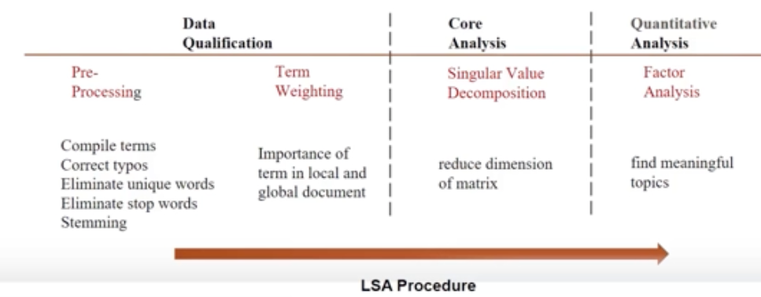
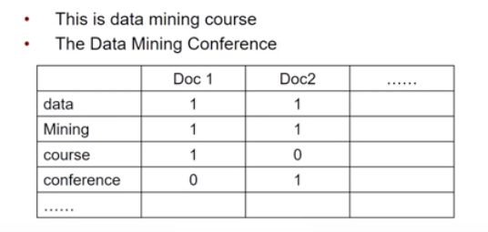
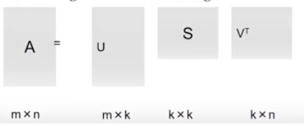

```{r setup, include=FALSE}
knitr::opts_chunk$set(echo = TRUE)
```

# Text Analysis Overview

## Text Mining

Text mining is the use of computational techniques to extract information from text. It helps to automatically discover hidden knowledge in text, specifically from large amounts of unstructured text data.

Basic tasks include:

- Document classification or categorization
- Retrieving information 
- Clustering and organizing documents
- Information extraction

## Text Analytics Process

**Text preprocessing**, or cleaning the text data, is the first step before running any further analysis.

We can then choose from one of several techniques:

- Latent Semantic Analysis
- Latent Dirichlet Allocation
- Semantic Analysis

## R-Packages for Text Analysis

These are some common R-packages for performing text analysis. Be sure to install and load (`library()`) before using any of these tools.

- `tm`
  - Data import
  - Corpus handling
  - Preprocessing
  - Term-document
  - Creating matrices
- `Matrix`
  - Creating matrices
- `SnowballC`
  - Stemming
- `wordcloud`
  - Visual word cloud
- `lsa`
  - Concept Extraction
- `pdftools`
  - Read PDF files
- `qdap Tools`
  - Read word/docx files
- `stringr`
  - Reads strings

# Pre-Processing Data

## Process Overview

1. Read text file
2. Document decomposition
3. Remove non-English words
4. Transformation (e.g. simplifying data structure to facilitate relationships between words)
5. Lower characters - to prevent counting errors
6. Remove numbers
7. Remove stop words - common words that are likely to be frequent and add no information value (default and own)

  - E.g.: I, the, he, they, is, am, don't, does, not 
  - Also custom words such as the name of your company and product if you're analyzing product reviews
  
8. Remove punctuation
9. Remove white space - removing paragraphs, tabs, etc
10. Stemming - Reducing affected words to their word stem

  - E.g. Automatic, automation, automate can all be reduced to the same word
  - Typically removing prefixes and suffixes 
  - In English we use a *Porter Stemmer*, but in R we use a *Snowball Stemmer* 

11. Create document-term matrix
12. Simple analysis like word clouds
13. Big grownup analysis

## Packages

This example will use a few of the packages mentioned above, begin by loading them.

```{r message=FALSE, warning=FALSE}
#install.packages("tm")
#install.packages("SnowballC")
#install.packages("wordcloud")
#install.packages("Matrix)"

library(tm)
library(stringr)
library(SnowballC)
library(wordcloud)
library(Matrix)
```


## Reading Multiple .txt Files 

Because our data consists of multiple separate files, it will be easier to set our present working directory (PWD) to the directory (folder) containing these files. Note: this only changes the PWD for the scope of the chunk. Changing the global PWD needs to be done at the knitr level.

### Corpus 

Corpus is similar to a data set in a general ML task

- It represents a collection of documents containing natural language text
  - The entire body of writing on a particular subject
- Typically contains text annotation or metadata
- Metadata
  - **Corpus Metadata**: contains corpus specific metadata in the form of tag-value pairs
  - **Document Metadata**: contains document specific metadata stored in the corpus as a data frame
    - Typically used for semantic or performance reasons 
- `Corpus(DirSource())` allows us to import an entire folder/directory of files into a single corpus object 
  - Once it imports, we see it contains 200 documents


```{r}
filepath <- ("Data Sets/7.0-txt_examples/txt")
setwd(filepath)
dir(filepath)

corpus <- Corpus(DirSource(filepath))
corpus
```

## Reading a Single File

Maybe this should have come first?

Prof's example has us repeating the steps above to change the PWD. That's probably good practice, but I'm not doing it. 

### `file` Function 

Creates, opens, and closes connections such as files, URLs, pipes, etc

- `mode` Argument
  - r or rt for opening/reading in text mode (we use this)
  - w or wt for writing in text mode
  - a or at for appending in text mode
  - Similar arguments for binary mode which is out of scope
  
### `readLines()` Function

Reads the lines from a connection, in this case we can query lines 1 and 2 individually to read them. 

### `VectorSource()` Function

A vector source interprets each element of the vector passed in as a document. In our case, each of those elements is a line, and each of those lines is a review. This almost simulates each review/line being its own text file as it was above. 

### Single File Code

```{r}
text = file("Data Sets/7.0-txt_examples/HBO_Now.txt", open = "r")
text.decomposition = readLines(text)
text.decomposition[1]
text.decomposition[2]
corpusHBO <- Corpus(VectorSource(text.decomposition))
corpusHBO
```

## Data Cleaning with `tm_map()`

The FUNction argument allows us to specify the data cleaning tools.

### Lower Characters with `FUN = tolower`

```{r}
corpus <- tm_map(corpus, tolower)
```

### Remove Numbers with `FUN = removeNumbers`

Numbers may be useful, but in this case they are likely unique and not useful for aggregate analysis.

```{r}
corpus <- tm_map(corpus, removeNumbers)
```


### Remove Punctuation with `FUN = removePunctuation`

```{r}
corpus <- tm_map(corpus, removePunctuation)
```

### Remove Stop Words with `FUN = removeWords`

`stopwords()` is a function provided by `tm` with a built-in list of common stop words for various languages. Running just this function prints the list of these words. 

Extra steps:

- Create a vector of our own stop words we want to screen out and save as an object
- Pass this object along with stopwords as a vector into the tm_map function as an argument

We'll start reviewing the printouts from now on with `writeLines()`
- Remember that viewing a line requires a double bracket notation 
  - I'm not sure why or what exactly I'm supposed to remember but sure
- Cast it as a character too for some reason

```{r}
stopwords("en")

selfstopwords <- c("app", "hbo", "now")

corpus<- tm_map(corpus, removeWords, c(stopwords("en"), selfstopwords))

# Review output

writeLines(as.character(corpus[[2]]))
```

### Strip Whitespace with `FUN = stripWhitespace`

Notice that the words are now only separated by a single space.

```{r}
corpus <- tm_map(corpus, stripWhitespace)

writeLines(as.character(corpus[[2]]))
```

### Stemming with `FUN = stemDocument`

```{r}
corpus <- tm_map(corpus, stemDocument)

writeLines(as.character(corpus[[2]]))
```


# Latent Semantic Analysis (LSA) 

## LSA Overview

LSA is a technique for creating a vector representation of a document which allows us to compare documents for their simalirty by calculating the distance between the vectors. We can extract and infer relations of the expected contextual usage of particular words.

>Latent Semantic Analysis is a theory and method for extarcting and repsenting the contextual-usage meaning of words by statistical computations applied to a large corpus of text (Landauer and Dumais, 1997) 

LSA is based on linear algebra concepts, specifically reducing a sparse-term document co-occurrence matrix with singular value decomposition.  

- Not a traditional natural-language processor. There is no training based on dictionaries, grammar, semantic networks, etc
- Takes as input only raw text parsed into words defined as unique character streams and separated into meaningful text samples



## LSA Model Construction

### Create the Term Matrix

First we build a term-document matrix that shows which terms appear in each document
- Rows: words, also denoted $i$
- Columns: documents, also denoted $j$
- Cell: frequency that each word appears in a document


### Transform Matrix with Weights

$weight_{i,j} = lw(tf_{i,j}) * gw(tf_{i,j})$

- i: rows, words
- j: columns, documents
- lw: local weight
  - Controls for word frequency
  - Compresses the effects of frequency
- gw: global weight
  - Controls for the number of each docs each word appeared in
  - Words that occur in few documents may be more informative about those documents than common words that appear in many 
  
#### TF-IDF Weighting

This method compares two calculations: term-frequency (TF) and inverse document frequency (IDF)

**Term-Frequency (TF)**:

$tf_{i,j}$

  - The importance of a term (frequency) $i$ within a document $j$
  
**Inverse Document Frequency (IDF)**:

$\log\frac{N}{df_i}$

- The importance of the term in the corpus
  - N: total number of documents
  - $df_i$: number of documents containing term $i$
  - The amount of information provided by that particular word
  - If the IDF value is low, the word is less useful as it appears in many documents
  
$weight_{i,j} = tf_{i,j} * \log\frac{N}{df_i}$

## Single-Value Decomposition

This method reduces the number of dimensions by "projecting" many (like 10s of thousands many) onto a smaller number.

- It addresses a limitation of TF-IDF vectors that contain a large number of words: most of the columns will be filled with mostly zeroes.
- E.g. doc1 contains "fruit", doc2 contains "vegetables", doc3 contains both
  - TF-IDF may miss the that both words belong to the same group and thus the three documents are all related 
  

Our term Matrixis decomposed into the product of three other matrices:

- Two with orthonormal columns
- One with singular values on the diagonal 

$\{A\} = \{U\}\{S\}\{V\}^T$



# Latent Semantic Analysis in R


# Latent Dirichlet Allocation (LDA)


# Latent Dirichlet Allocation in R


## Topic Models

This was part of LSA, may delete later not sure where it fits

- Discover hidden topic-based patterns, LSA is one of these models 
- We assume that documents contain topics which contain related words
- Two approaches:
  - Linear algebra
    - Sparse term document
    - Co-occurence matrix
  - Probabilistic modeling 
  