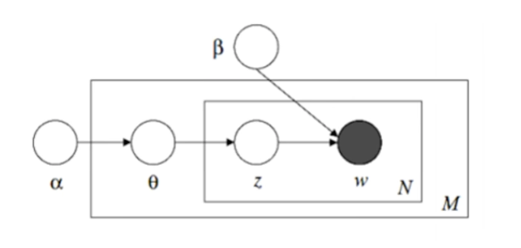

```{r setup, include=FALSE}
knitr::opts_chunk$set(echo = TRUE)
```

# Text Analysis Overview

## Text Mining

Text mining is the use of computational techniques to extract information from text. It helps to automatically discover hidden knowledge in text, specifically from large amounts of unstructured text data.

Basic tasks include:

- Document classification or categorization
- Retrieving information 
- Clustering and organizing documents
- Information extraction

## Text Analytics Process

**Text preprocessing**, or cleaning the text data, is the first step before running any further analysis.

We can then choose from one of several techniques:

- Latent Semantic Analysis
- Latent Dirichlet Allocation
- Semantic Analysis

## R-Packages for Text Analysis

These are some common R-packages for performing text analysis. Be sure to install and load (`library()`) before using any of these tools.

- `tm`
  - Data import
  - Corpus handling
  - Preprocessing
  - Term-document
  - Creating matrices
- `Matrix`
  - Creating matrices
- `SnowballC`
  - Stemming
- `wordcloud`
  - Visual word cloud
- `lsa`
  - Concept Extraction
- `pdftools`
  - Read PDF files
- `qdap Tools`
  - Read word/docx files
- `stringr`
  - Reads strings

# Pre-Processing Data

## Process Overview

1. Read text file
2. Document decomposition
3. Remove non-English words
4. Transformation (e.g. simplifying data structure to facilitate relationships between words)
5. Lower characters - to prevent counting errors
6. Remove numbers
7. Remove stop words - common words that are likely to be frequent and add no information value (default and own)

  - E.g.: I, the, he, they, is, am, don't, does, not 
  - Also custom words such as the name of your company and product if you're analyzing product reviews
  
8. Remove punctuation
9. Remove white space - removing paragraphs, tabs, etc
10. Stemming - Reducing affected words to their word stem

  - E.g. Automatic, automation, automate can all be reduced to the same word
  - Typically removing prefixes and suffixes 
  - In English we use a *Porter Stemmer*, but in R we use a *Snowball Stemmer* 

11. Create document-term matrix
12. Simple analysis like word clouds
13. Big grownup analysis

## Packages

This example will use a few of the packages mentioned above, begin by loading them.

```{r message=FALSE, warning=FALSE}
#install.packages("tm")
#install.packages("SnowballC")
#install.packages("wordcloud")
#install.packages("Matrix)"

library(tm)
library(stringr)
library(SnowballC)
library(wordcloud)
library(Matrix)
```


## Reading Multiple .txt Files 

Because our data consists of multiple separate files, it will be easier to set our present working directory (PWD) to the directory (folder) containing these files. Note: this only changes the PWD for the scope of the chunk. Changing the global PWD needs to be done at the knitr level.

### Corpus 

Corpus is similar to a data set in a general ML task

- It represents a collection of documents containing natural language text
  - The entire body of writing on a particular subject
- Typically contains text annotation or metadata
- Metadata
  - **Corpus Metadata**: contains corpus specific metadata in the form of tag-value pairs
  - **Document Metadata**: contains document specific metadata stored in the corpus as a data frame
    - Typically used for semantic or performance reasons 
- `Corpus(DirSource())` allows us to import an entire folder/directory of files into a single corpus object 
  - Once it imports, we see it contains 200 documents


```{r}
filepath <- ("Data Sets/7.0-txt_examples/txt")
#setwd(filepath)
#dir(filepath)

corpus <- Corpus(DirSource(filepath))
corpus
```

## Reading a Single File

Maybe this should have come first?

Prof's example has us repeating the steps above to change the PWD. That's probably good practice, but I'm not doing it. 

### `file` Function 

Creates, opens, and closes connections such as files, URLs, pipes, etc

- `mode` Argument
  - r or rt for opening/reading in text mode (we use this)
  - w or wt for writing in text mode
  - a or at for appending in text mode
  - Similar arguments for binary mode which is out of scope
  
### `readLines()` Function

Reads the lines from a connection, in this case we can query lines 1 and 2 individually to read them. 

### `VectorSource()` Function

A vector source interprets each element of the vector passed in as a document. In our case, each of those elements is a line, and each of those lines is a review. This almost simulates each review/line being its own text file as it was above. 

### Single File Code

```{r}
text = file("Data Sets/7.0-txt_examples/HBO_Now.txt", open = "r")
text.decomposition = readLines(text)
text.decomposition[1]
text.decomposition[2]
corpusHBO <- Corpus(VectorSource(text.decomposition))
corpusHBO
```

## Data Cleaning with `tm_map()`

The FUNction argument allows us to specify the data cleaning tools.

### Lower Characters with `FUN = tolower`

```{r}
corpus <- tm_map(corpus, tolower)
```

### Remove Numbers with `FUN = removeNumbers`

Numbers may be useful, but in this case they are likely unique and not useful for aggregate analysis.

```{r}
corpus <- tm_map(corpus, removeNumbers)
```


### Remove Punctuation with `FUN = removePunctuation`

```{r}
corpus <- tm_map(corpus, removePunctuation)
```

### Remove Stop Words with `FUN = removeWords`

`stopwords()` is a function provided by `tm` with a built-in list of common stop words for various languages. Running just this function prints the list of these words. 

Extra steps:

- Create a vector of our own stop words we want to screen out and save as an object
- Pass this object along with stopwords as a vector into the tm_map function as an argument

We'll start reviewing the printouts from now on with `writeLines()`
- Remember that viewing a line requires a double bracket notation 
  - I'm not sure why or what exactly I'm supposed to remember but sure
- Cast it as a character too for some reason

```{r}
# Review normal stopwords list
#stopwords("en")

selfstopwords <- c("app", "hbo", "now")

corpus<- tm_map(corpus, removeWords, c(stopwords("en"), selfstopwords))

# Review output

#writeLines(as.character(corpus[[2]]))
```

### Strip Whitespace with `FUN = stripWhitespace`

Notice that the words are now only separated by a single space.

```{r}
corpus <- tm_map(corpus, stripWhitespace)

writeLines(as.character(corpus[[2]]))
```

### Stemming with `FUN = stemDocument`

```{r}
corpus <- tm_map(corpus, stemDocument)

writeLines(as.character(corpus[[2]]))
```


# Latent Semantic Analysis (LSA) 

## LSA Overview

LSA is a technique for creating a vector representation of a document which allows us to compare documents for their simalirty by calculating the distance between the vectors. We can extract and infer relations of the expected contextual usage of particular words.

>Latent Semantic Analysis is a theory and method for extarcting and repsenting the contextual-usage meaning of words by statistical computations applied to a large corpus of text (Landauer and Dumais, 1997) 

LSA is based on linear algebra concepts, specifically reducing a sparse-term document co-occurrence matrix with singular value decomposition.  

- Not a traditional natural-language processor. There is no training based on dictionaries, grammar, semantic networks, etc
- Takes as input only raw text parsed into words defined as unique character streams and separated into meaningful text samples


## LSA Model Construction

### Create the Term Matrix

First we build a term-document matrix that shows which terms appear in each document
- Rows: words, also denoted $i$
- Columns: documents, also denoted $j$
- Cell: frequency that each word appears in a document


### Transform Matrix with Weights

$weight_{i,j} = lw(tf_{i,j}) * gw(tf_{i,j})$

- i: rows, words
- j: columns, documents
- lw: local weight
  - Controls for word frequency
  - Compresses the effects of frequency
- gw: global weight
  - Controls for the number of each docs each word appeared in
  - Words that occur in few documents may be more informative about those documents than common words that appear in many 
  
#### TF-IDF Weighting

This method compares two calculations: term-frequency (TF) and inverse document frequency (IDF)

**Term-Frequency (TF)**:

$tf_{i,j}$

  - The importance of a term (frequency) $i$ within a document $j$
  
**Inverse Document Frequency (IDF)**:

$\log\frac{N}{df_i}$

- The importance of the term in the corpus
  - N: total number of documents
  - $df_i$: number of documents containing term $i$
  - The amount of information provided by that particular word
  - If the IDF value is low, the word is less useful as it appears in many documents
  
$weight_{i,j} = tf_{i,j} * \log\frac{N}{df_i}$

## Single-Value Decomposition (SVD)

This method reduces our sparse-term matrix into a more dense matrix where each of the columns represents a topic ($k$) rather than a document. Topics are conceptual groupings of words that co-occur with other terms in a similar document. 

- It addresses a limitation of TF-IDF vectors that contain a large number of words: most of the columns will be filled with mostly zeroes "sparse-term"
- E.g. doc1 contains "fruit", doc2 contains "vegetables", doc3 contains both
  - TF-IDF may miss the that both words belong to the same group and thus the three documents are all related 
  

Our term Matrix $A$ is decomposed into the product of three other matrices:

- $U$ relates terms (m) to a concept (k)
  - $m*k$
- $S$ is a diagonal matrix of single values
  - $k*k$
- $V^T$ relates concepts (k) to documents (n)
  - $k*n$

$\{A\} = \{U\}\{S\}\{V\}^T$

In the matrix calculations:

- m: # of terms
- n: # of documents
- k: # of topics


# Latent Semantic Analysis in R

Building on the pre-processing examples above, we can look at performing LSA in R.

## Create `workcloud`

A fun visualize the frequency of our data is to use a wordcloud.

```
wordcloud(words,freq,scale=c(4,.5),min.freq=3,max.words=Inf,
	random.order=TRUE, random.color=FALSE, rot.per=.1,
	colors="black",ordered.colors=FALSE,use.r.layout=FALSE,
	fixed.asp=TRUE, ...)
```

We pass in as arguments:

- `corpus`
  - the data
- `min.freq = 10`
  - words below this frequency will not be plotted
- `random.order = FALSE`
  - The cloud will be arranged with high-frequency words placed close to the center
  - TRUE would have words arranged randomly, the default

```{r}
library(wordcloud)

wordcloud(corpus, min.freq = 10, random.order = FALSE)

```

This time, we leave default random.order of TRUE and add a color palette: 
- `colors~brewer.pal(8, "Dark2"))`

```{r}
wordcloud(corpus, min.freq = 10, colors = brewer.pal(8,"Dark2"))
```


## Create Term-Document Matrix (TDM)

The `tm` package provides tools to tokenize the text file corpus.

### `TermDocumentMatrix()` Function

This will take our corpus and convert it to a term-document matrix with:
- rows as words
- columns as documents

There is also a function for `DocumentTermMatrix()` which creates the matrix with words and documents flipped in rows and columns

- Generally it is easier to display many rows than many columns, so choose the method most suitable for your data

```{r}
corpus.tdm <- TermDocumentMatrix(corpus)
write.csv(as.matrix(corpus.tdm), file = "Data Sets/7.1_tdm1.csv")
```

### `findFreqTerms()` 

Used to find frequent terms in our term-document matrix and returns the character vectors containing the words that appear at least the specified number of times (in this case 5)

```{r}
corpus_freq_words <- findFreqTerms(corpus.tdm, 5)

# Examine the words
#corpus_freq_words
```

### Create Weighted TDM

Next we create a weighted term-document matrix that emphasizes the importance of a term within its document (**local weight**) and the overall corpus (**global weight**). 

#### `weightTfIdf()`

Weights a term-document matrix by term frequency - inverse document frequency. Requires document to be in term frequency format. Optional normalize argument to normalize the term frequencies.


Applies the log term we learned above: $\log\frac{N}{df_i}$


```{r}
corpus_tdm_weighted <- weightTfIdf(corpus.tdm)
```

### Specify the Dimensions

The number of topics

```{r}
userdimension = 10
```


## Do the Analysis

### `LSA()` Function

Creates an estimated matrix based on LSA. Input our weighted document-term matrix with the expected number of topics. 

- The summary shows us that the resulting object contains tk, dk, and sk matrices

```{r}
#install.packages("lsa")
library(lsa)
corpus_tdm_weighted_LSA <- lsa(corpus_tdm_weighted, dims = userdimension)

# Summarize the resulting matrix
summary(corpus_tdm_weighted_LSA)
```

### Term Matrix

The term matrix is represented in our single-value decomposition as $U$:

- $U$ relates terms (m) to a topic (k)
  - $m*k$

```{r}
tk <- as.matrix(corpus_tdm_weighted_LSA$tk)
```


### Diagonal Matrix

The diagonal matrix of single values is represented in our single-value decomposition as $S$:

- $S$ is a single-value diagonal matrix
  - $k*k$

Use `Diagonal()` to create a diagonal matrix with the number of dimensions and the LSA `sk` object

```{r}
sk <- Diagonal(n = userdimension, as.matrix(corpus_tdm_weighted_LSA$sk))
```

### Document Matrix

- $V^T$ relates concepts (k) to documents (n)
  - $k*n$

```{r}
dk <- as.matrix(corpus_tdm_weighted_LSA$dk)
```

## Term Loading 

Can be found by multiplying the Term Matrix $U$ by the diagonal matrix $S$

- In this case tk and sk
- "What are the terms loaded into the topics?"
- Use `write.csv()` to save the resulting term loading into a csv for later use

```{r}
termloading <- tk %*% sk

# Write the term loading

write.csv(as.matrix(termloading), file = "Data Sets/7.2_term_loading.csv")
```

## Document Loading

Can be found by multiplying the document matrix $V^T$ by the diagonal matrix $S$

- dk * sk
- Gives us the relationship between topics and documents
- Again we write this to a file

```{r}
docloading <- dk %*% sk

# write

write.csv(as.matrix(docloading), file = "Data Sets/7.3_doc_loading.csv")
```


# Latent Dirichlet Allocation (LDA)

## LDA Overview

LDA is a topic model that generates topics based on word frequency from a set of documents. It's especially useful for finding reasonably accurate mixtures of topics within a given document.

- Example: Given a data set with all news articles of France from 2018, generate some highlights (topics) 
- Proposed by Blei et. al. in 2003

### Assumptions

- Documents with similar topics will use similar groupings of words
- Documents are probability distributions over latent topics
- Topics are probability distributions over words 
  - This model relies on these distributions instead of raw frequencies
 
### Plate Notation
 
 

- Two main rectangles define whether the parameter is applied to:
  - M: The total number of documents in the corpus
    - Θ: Topic distribution for documents
      - $θ_{m}$ topic distribution for document $m$
   distribution among them
  - N: The total number of words in the document
    - z: Denotes each topic assigned to each word
      - $z_{mn}$ is the topic for the $n$th word in document $m$
    - w: Denotes word
      - $w_{mn}$ the $n$th word in document $m$
- **Dirichlet Priors**
  - α: Dirichlet parameter on the per-document topic distribution
    - A high α indicates that each document is likely to contain a mixture of most of the topics and not just one or two in particular
    - A low α indicates that a document distribution contains just a few of the topics
  - β: Parameter on the per-topic word distribution
    - High β indicates that each topic is likely to contain a mixture of most of the words
    - Low β vice-versa


 from Bhavesh Bhatt.

 from Scott Sullivan

## LDA Process

- LDA starts by randomly assigning topics to every word in the documents
- Calculates a matrix with the count of documents in every topic

### Reassignment

Reassigns the topic for a given word.

- First removes the current topic assignment and decrements that topic by 1
- Choose the reassigning topic based on two probability calculations:
  - How much a document "likes" each topic based on other assignments in the *same* document
  - How much each topic "likes" a specific word based on assignments in *other* documents
- Multiply these probabilities
  - (how much doc likes topic) * (how much topic likes a word)
- Reassign the topic for the word based on the highest resulting probability 
- Repeat this process for every word in the corpus for a single pass
  - Most LDA processes will do multiple passes to keep iterating on the "best" topic reassignment
  
# Latent Dirichlet Allocation in R

```{r message=FALSE, warning=FALSE}
#install.packages("topicmodels")
library(topicmodels)
data("AssociatedPress")
AssociatedPress
```

## LDA R Overview

### Create Topic Models

This example uses Associated Press data containing a document-term matrix of 10,473 terms in 2,246 documents.

#### `LDA()` Function

Estimates an LDA model using for example the VEM algorithm or Gibbs Sampling. From the `topicmodels` package.

- LDA returns several objects with details of the model such as
  - how words are associated with the topic
  - how topics are associated with the document

Arguments: Data and k (# of topics)

```{r}
set.seed(1234)
apLda <- LDA(AssociatedPress, k=2)

apLda
```

### Data Format with `tidytext`

`tidytext` provides functions that allow the conversion of text to and from tidy format and switch seamlessly between tidy tools and existing data mining packages.

We'll do some formatting to figure out **word topic probabilities**

### Term (Beta) Matrix 

Estimates the per-topic probability of the term

`tidy(x, matrix = "beta)` 

Setting matrix to beta turns our model into a format of *one topic per term per row*. The last column shows the probability of the term being generated from that particular topic.

```{r message=FALSE, warning=FALSE}
#install.packages("tidytext")
library(tidytext)

ap_topics <- tidy(apLda, matrix = "beta")
ap_topics
```
#### Top 5 Terms in each Topic

##### `dplyr` package

Allows us to use pipe operator to arrange a top_terms matrix. The results show us the top 5 terms in each topic.

```{r message=FALSE, warning=FALSE}
#install.packages("dplyr")
suppressWarnings(library(dplyr))

top_terms <- ap_topics %>%
    group_by (topic) %>%
    top_n (5, beta) %>%
    arrange (topic, -beta)

top_terms
```
### Document-Term (Gamma) Matrix

Estimate term per-document probability.

`tidy(x, matrix = "gamma")`

The first line can be interpreted as "46% of terms from document 1 are generated from topic 1."

```{r}
#library(tidytext)
ap_document <- tidy(apLda, matrix = "gamma")
ap_document
```

### Filter for Documents

Use the `filter()` function on the document-term matrix (`AssociatedPress`) to pick a specific document. Remember that in this matrix each row is a document, so to grab document 6 we just filter for row 6 in the matrix.

Use `arrange(desc(count)` to arrange our results for document six by the count of each term descending.

```{r}
tidy(AssociatedPress) %>%
  filter(document == 6) %>%
  arrange(desc(count))
```
## LDA with Optimal K

This example builds on the HBO data above, be sure to run that code first.

### Find Optimal Value of k

We find the ideal value for k by calculating **Perplexity**

- This is a resource intensive calculation so we will cheat and pick some candidate values for k `can_k`
- Begin by setting up an empty matrix that we can fill out by looping through each potential k value below

```{r}
can_k <- c(2,3,4,5,10,20,40,60,100)

results <- matrix(0, nrow = length(can_k), ncol = 2)
colnames(results) <- c("k", "Perplexity")
```

#### Create Document-Term Matrix

```{r}
corpus.dtm <- DocumentTermMatrix(corpus)
```


#### Run LDA with Multiple k-values

We will loop through the model the number of times needed to test every candidate `length(can_k)` and fill in our matrix above.

- Input corpus DTM from above
- `method = "Gibbs"`
  - Uses Markov-Chain Monte Carlo algorithm
- `burnin = 1000`
  - The model will run this many times before starting to record results
- `thin = 100` and `iterator= 1000`
  - Model will run another 1000 iterations and record the result every 100th (thin) run

```{r}
for (j in 1:length(can_k)){
  k <- can_k[j]
  SEED <- 2019
  text.lda <- LDA(corpus.dtm, k=k, method = "Gibbs",
                  control = list(seed = SEED, burnin = 1000,
                                 thin = 100, iter = 1000))
  results[j,] <- c(k, perplexity(text.lda, newdata = corpus.dtm))
}

results_df <- as.data.frame(results)
results_df
```

The resulting filled matrix shows that the lowest Perplexity is achieved at k = 10. Let's use that for our model.

### Run Model with Optimal k

```{r}
k <- 10
SEED <- 2019
text.lda <- LDA(corpus.dtm, k = k, method = "Gibbs",
                  control = list(seed = SEED, burnin = 1000,
                                 thin = 100, iter = 1000))

```

### LDA Model Output

Save the probability distributions of terms and topics.

- Use `t()` to transpose the Terms matrix

```{r}
Terms <- posterior(text.lda)$terms
Topics <- posterior(text.lda)$topics

write.csv(t(as.matrix(Terms)), file = "Data Sets/7.4_TermsLDA.csv")

write.csv(as.matrix(Topics), file = "Data Sets/7.5_TopicsLDA.csv")
```

#### Write the Top Terms for each Topic

```{r}
top.terms <- terms(text.lda, 10)
write.csv(as.matrix(top.terms), file = "Data Sets/7.6_TopTermsLDA.csv")
```


